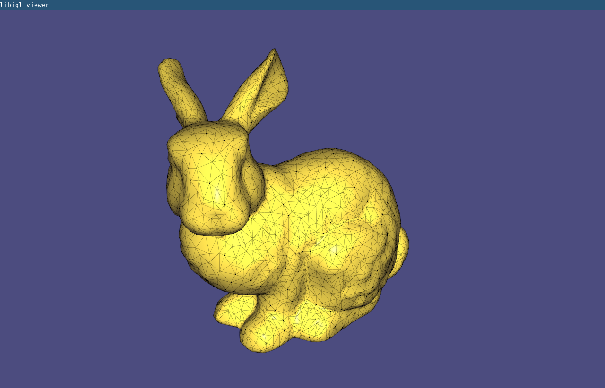
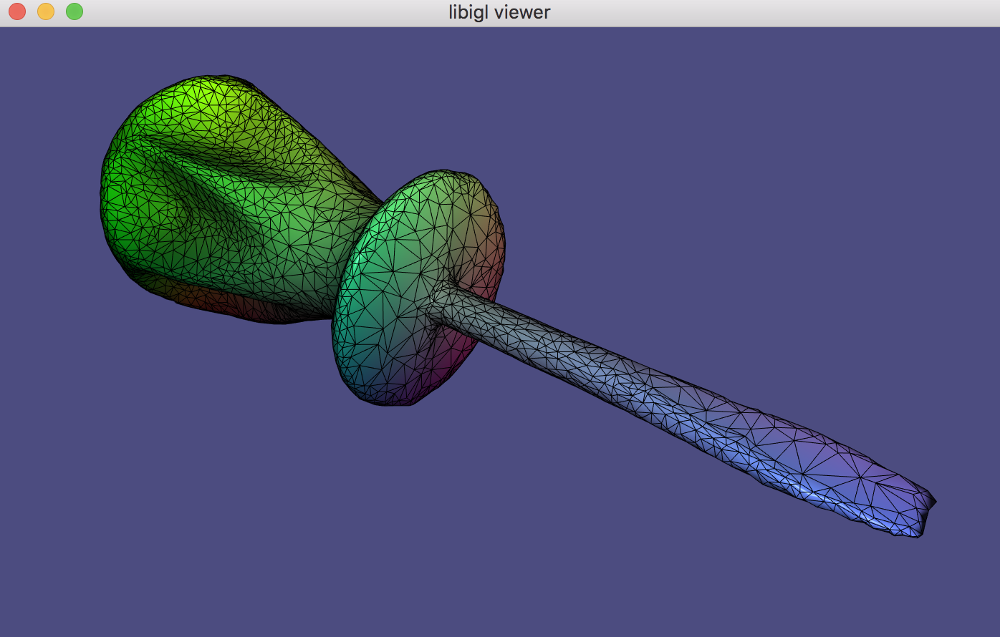
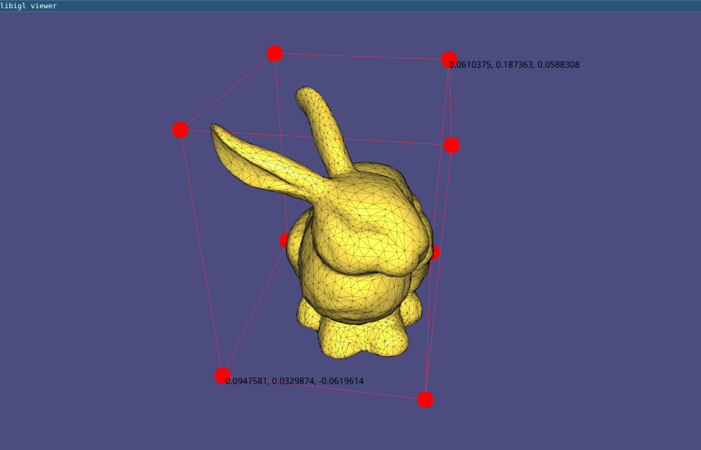
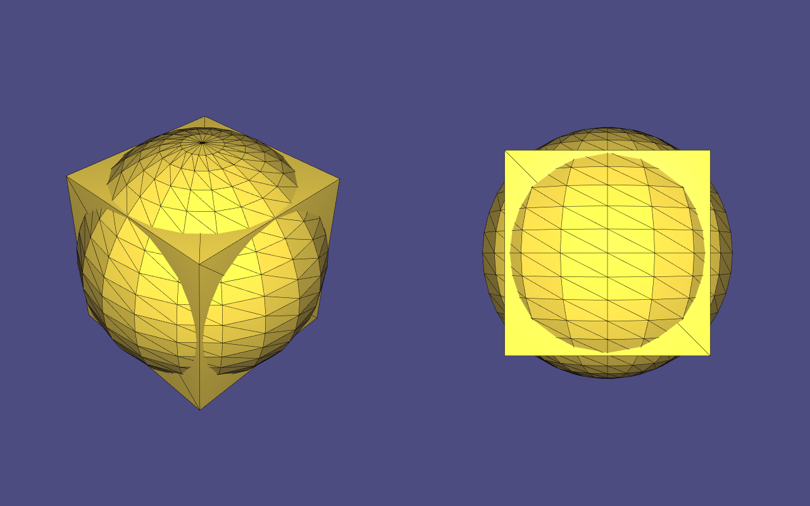
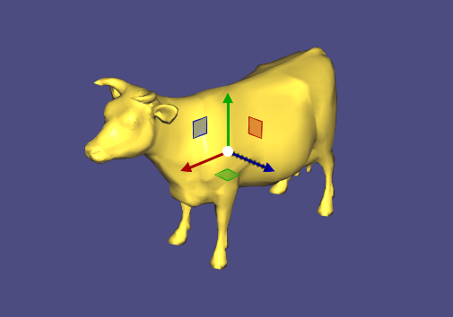
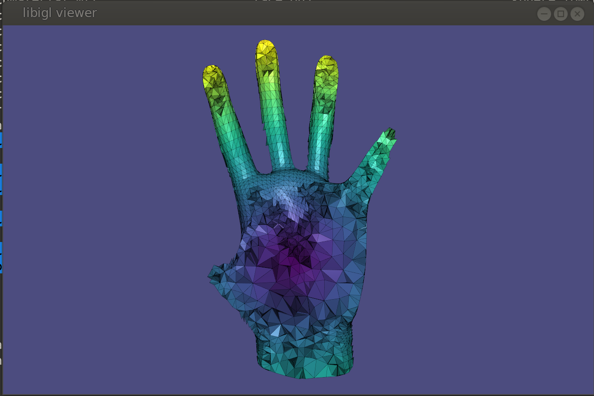
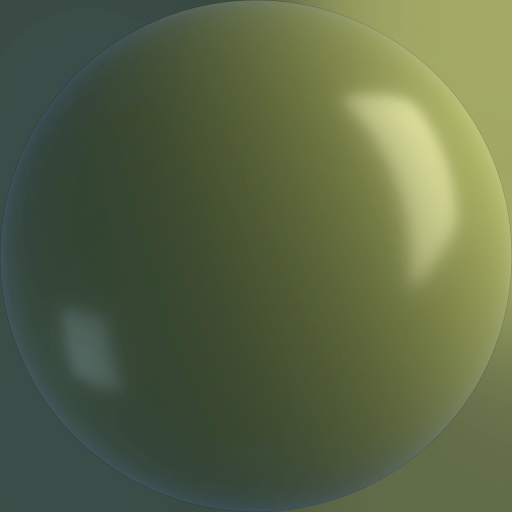

# Overview

Libigl is an open source C++ library for **geometry processing** research and development.

## References

- [libigl | SIGGRAPH Asia 2017 Courses](https://dl.acm.org/doi/pdf/10.1145/3134472.3134497)
- [libigl tutorial | Chapter-1](https://libigl.github.io/tutorial/#chapter-1)

## Chapter 1

In this chapter, we will present the basic concepts of libigl and introduce **a simple mesh viewer** that allows to visualize a surface mesh and its attributes.

### Download Libigl

```shell
git clone git@github.com:libigl/libigl.git
git clone https://github.com/libigl/libigl.git
```

Build all the examples in the tutorial (and tests):

```shell
cd libigl && mkdir build && cd build
cmake ..
make
```

My system is `Mac M2 Ventura 13.0`, there were several errors that occurred during the build process

```shell
CMake Warning at CMakeLists.txt:73 (message):
  Matlab not found, disabling igl_restricted::matlab module.
CMake Warning at CMakeLists.txt:78 (message):
  Mosek not found, disabling igl_restricted::mosek module.
```

### Mesh Representation

libigl uses the **Eigen** library to encode vector and matrices.

A triangular mesh is encoded as a pair of matrices:

```cpp
Eigen::MatrixXd V;
Eigen::MatrixXi F;
```

`V` is a #N by 3 matrix which stores the coordinates of the vertices. Each row stores the coordinate of a vertex, with its x,y and z coordinates in the first, second and third column, respectively. The matrix `F` stores the triangle connectivity: each line of `F` denotes a triangle whose 3 vertices are represented as indices pointing to rows of `V`.


libigl provides input [output] functions to read [write] many common mesh formats. The IO functions are contained in the files read*.h and write*.h. As a general rule each libigl function is contained in a pair of .h/.cpp files with the same name. By default, the .h files include the corresponding cpp files, making the library header-only.

Reading a mesh from a file requires a single libigl function call:

```cpp
igl::readOFF(TUTORIAL_SHARED_PATH "/cube.off", V, F)
```

Similarly, a mesh can be written in an OBJ file using:

```cpp
igl::writeOBJ("cube.obj",V,F);
```

**Example 101**

```cpp
#include <igl/readOFF.h>
#include <igl/writeOBJ.h>
#include <iostream>

Eigen::MatrixXd V;
Eigen::MatrixXi F;

int main(int argc, char *argv[])
{
  // Load a mesh in OFF format
  igl::readOFF(TUTORIAL_SHARED_PATH  "/cube.off", V, F);

  // Print the vertices and faces matrices
  std::cout << "Vertices: " << std::endl << V << std::endl;
  std::cout << "Faces:    " << std::endl << F << std::endl;

  // Save the mesh in OBJ format
  igl::writeOBJ("cube.obj",V,F);
}
```

### Visualizing Surfaces

Libigl provides an glfw-based OpenGL 3.2 viewer to visualize surfaces, their properties and additional debugging information.

**Example 102**

```cpp
#include <igl/readOFF.h>
#include <igl/opengl/glfw/Viewer.h>

Eigen::MatrixXd V;
Eigen::MatrixXi F;

int main(int argc, char *argv[])
{
  // Load a mesh in OFF format
  igl::readOFF(TUTORIAL_SHARED_PATH "/bunny.off", V, F);

  // Plot the mesh
  igl::opengl::glfw::Viewer viewer;
  viewer.data().set_mesh(V, F);
  viewer.launch();
}
```

The function `set_mesh` copies the mesh into the viewer. `Viewer.launch()` creates a window, an OpenGL context and it starts the draw loop.

The default camera motion mode is 2-axis (`ROTATION_TYPE_TWO_AXIS_VALUATOR_FIXED_UP`), which can be changed to 3-axis trackball style by adding this line:

```cpp
viewer.core().set_rotation_type(igl::opengl::ViewerCore::ROTATION_TYPE_TRACKBALL);
```

More about [Viewer.h](https://github.com/libigl/libigl/blob/main/include/igl/opengl/glfw/Viewer.h).

### Interaction With Keyboard And Mouse

Keyboard and mouse events triggers callbacks that can be registered in the viewer. The viewer supports the following callbacks:

```cpp
bool (*callback_pre_draw)(Viewer& viewer);
bool (*callback_post_draw)(Viewer& viewer);
bool (*callback_mouse_down)(Viewer& viewer, int button, int modifier);
bool (*callback_mouse_up)(Viewer& viewer, int button, int modifier);
bool (*callback_mouse_move)(Viewer& viewer, int mouse_x, int mouse_y);
bool (*callback_mouse_scroll)(Viewer& viewer, float delta_y);
bool (*callback_key_down)(Viewer& viewer, unsigned char key, int modifiers);
bool (*callback_key_up)(Viewer& viewer, unsigned char key, int modifiers);
```

A keyboard callback can be used to visualize multiple meshes or different stages of an algorithm, as demonstrated in **Example 103**, where the keyboard callback changes the visualized mesh depending on the key pressed:

```cpp
#include <igl/readOFF.h>
#include <igl/opengl/glfw/Viewer.h>
#include <iostream>

Eigen::MatrixXd V1,V2;
Eigen::MatrixXi F1,F2;

// This function is called every time a keyboard button is pressed
bool key_down(igl::opengl::glfw::Viewer& viewer, unsigned char key, int modifier) {
    std::cout<<"Key: "<<key<<" "<<(unsigned int)key<<std::endl;
    if (key == '1')
    {
        // Clear should be called before drawing the mesh
        viewer.data().clear();
        // Draw_mesh creates or updates the vertices and faces of the displayed mesh.
        // If a mesh is already displayed, draw_mesh returns an error if the given V and
        // F have size different than the current ones
        viewer.data().set_mesh(V1, F1);
        viewer.core().align_camera_center(V1,F1);
    }
    else if (key == '2')
    {
        viewer.data().clear();
        viewer.data().set_mesh(V2, F2);
        viewer.core().align_camera_center(V2,F2);
    }

    return false;
}

int main(int argc, char *argv[]) {
    // Load two meshes
    igl::readOFF(TUTORIAL_SHARED_PATH "/bumpy.off", V1, F1);
    igl::readOFF(TUTORIAL_SHARED_PATH "/fertility.off", V2, F2);

    std::cout<<R"(
        1 Switch to bump mesh
        2 Switch to fertility mesh
    )";

    igl::opengl::glfw::Viewer viewer;
    // Register a keyboard callback that allows to switch between the two loaded meshes
    viewer.callback_key_down = &key_down;
    viewer.data().set_mesh(V1, F1);
    viewer.launch();
}
```

Note that the mesh is cleared before using `set_mesh`. This has to be called every time the number of vertices or faces of the plotted mesh changes.

Every callback returns a boolean value that tells the viewer if the event has been handled by the plugin, or if the viewer should process it normally. This is useful, for example, to disable the default mouse event handling if you want to control the camera directly in your code.

More about [ViewerPlugin.h](https://github.com/libigl/libigl/blob/main/include/igl/opengl/glfw/ViewerPlugin.h).

### Scalar Field Visualization

Colors can be associated to faces or vertices using the set_colors function:

```cpp
viewer.data().set_colors(C);
```

`C` is a #C by 3 matrix with one RGB color per row. `C` must have as many rows as the number of faces or the number of vertices of the mesh. Depending on the size of `C`, the viewer applies the color to the faces or to the vertices. In **Example 104**, the colors of mesh vertices are set according to their Cartesian coordinates.

```cpp
#include <igl/readOFF.h>
#include <igl/opengl/glfw/Viewer.h>

Eigen::MatrixXd V;
Eigen::MatrixXi F;
Eigen::MatrixXd C;

int main(int argc, char *argv[])
{
  // Load a mesh in OFF format
  igl::readOFF(TUTORIAL_SHARED_PATH "/screwdriver.off", V, F);

  // Plot the mesh
  igl::opengl::glfw::Viewer viewer;
  viewer.data().set_mesh(V, F);

  // Use the (normalized) vertex positions as colors
  C =
    (V.rowwise()            - V.colwise().minCoeff()).array().rowwise()/
    (V.colwise().maxCoeff() - V.colwise().minCoeff()).array();

  // Add per-vertex colors
  viewer.data().set_colors(C);

  // Launch the viewer
  viewer.launch();
}
```



Per-Vertex scalar fields can be directly visualized using `set_data` function:

```cpp
viewer.data().set_data(D);
```

`D` is a #V by 1 vector with one value corresponding to each vertex. `set_data` will color according to linearly interpolating the data within a triangle (in the fragment shader) and use this interpolated data to look up a color in a colormap (stored as a texture). The colormap defaults to `igl::COLOR_MAP_TYPE_VIRIDIS` with 21 discrete intervals. A custom colormap may be set with `set_colormap`.

### Overlays

In addition to plotting the surface, the viewer supports the visualization of points, lines and text labels: these overlays can be very helpful while developing geometric processing algorithms to plot debug information.

```cpp
viewer.data().add_points(P,Eigen::RowVector3d(r,g,b));
```

Draws a point of color r,g,b for each row of P. The point is placed at the coordinates specified in each row of P, which is a #P by 3 matrix. Size of the points (in pixels) can be changed globally by setting `viewer.data().point_size`.

```cpp
viewer.data().add_edges(P1,P2,Eigen::RowVector3d(r,g,b));
```

Draws a line of color r,g,b for each row of P1 and P2, which connects the 3D point in to the point in P2. Both P1 and P2 are of size #P by 3.

```cpp
viewer.data().add_label(p,str);
```

Draws a label containing the string str at the position p, which is a vector of length 3.

**Example 105**

```cpp
#include <igl/readOFF.h>
#include <igl/opengl/glfw/Viewer.h>
#include <igl/opengl/glfw/imgui/ImGuiPlugin.h>
#include <igl/opengl/glfw/imgui/ImGuiMenu.h>
#include <sstream>

Eigen::MatrixXd V;
Eigen::MatrixXi F;

int main(int argc, char *argv[]) {
    // Load a mesh in OFF format
    igl::readOFF(TUTORIAL_SHARED_PATH "/bunny.off", V, F);

    // Find the bounding box
    Eigen::Vector3d m = V.colwise().minCoeff();
    Eigen::Vector3d M = V.colwise().maxCoeff();

    // Corners of the bounding box
    Eigen::MatrixXd V_box(8,3);
    V_box <<  m(0), m(1), m(2),
              M(0), m(1), m(2),
              M(0), M(1), m(2),
              m(0), M(1), m(2),
              m(0), m(1), M(2),
              M(0), m(1), M(2),
              M(0), M(1), M(2),
              m(0), M(1), M(2);
    // Edges of the bounding box
    Eigen::MatrixXi E_box(12,2);
    E_box << 0, 1,
             1, 2,
             2, 3,
             3, 0,
             4, 5,
             5, 6,
             6, 7,
             7, 4,
             0, 4,
             1, 5,
             2, 6,
             7 ,3;
    // Plot the mesh
    igl::opengl::glfw::Viewer viewer;
    viewer.data().set_mesh(V, F);

    // Plot the corners of the bounding box as points
    viewer.data().add_points(V_box,Eigen::RowVector3d(1,0,0));

    // Plot the edges of the bounding box
    for (unsigned i=0;i<E_box.rows(); ++i)
        viewer.data().add_edges (
            V_box.row(E_box(i,0)),
            V_box.row(E_box(i,1)),
            Eigen::RowVector3d(1,0,0)
        );

    // Plot labels with the coordinates of bounding box vertices
    std::stringstream l1;
    l1 << m(0) << ", " << m(1) << ", " << m(2);
    viewer.data().add_label(m+Eigen::Vector3d(-0.007, 0, 0),l1.str());
    std::stringstream l2;
    l2 << M(0) << ", " << M(1) << ", " << M(2);
    viewer.data().add_label(M+Eigen::Vector3d(0.007, 0, 0),l2.str());
    // activate label rendering
    viewer.data().show_custom_labels = true;

    // Rendering of text labels is handled by ImGui, so we need to enable the ImGui
    // plugin to show text labels.
    igl::opengl::glfw::imgui::ImGuiPlugin plugin;
    viewer.plugins.push_back(&plugin);
    igl::opengl::glfw::imgui::ImGuiMenu menu;
    plugin.widgets.push_back(&menu);
    menu.callback_draw_viewer_window = [](){};

    // Launch the viewer
    viewer.launch();
}
```



### Viewer menu

As of latest version, the viewer uses a new menu and completely replaces AntTweakBar and nanogui with Dear ImGui. To extend the default menu of the viewer and to expose more user defined variables you have to implement a custom interface, as in **Example 106**:

```cpp
#include <igl/readOFF.h>
#include <igl/opengl/glfw/Viewer.h>
#include <igl/opengl/glfw/imgui/ImGuiPlugin.h>
#include <igl/opengl/glfw/imgui/ImGuiMenu.h>
#include <igl/opengl/glfw/imgui/ImGuiHelpers.h>
#include <iostream>

int main(int argc, char *argv[])
{
    Eigen::MatrixXd V;
    Eigen::MatrixXi F;

    // Load a mesh in OFF format
    igl::readOFF(TUTORIAL_SHARED_PATH "/bunny.off", V, F);

    // Init the viewer
    igl::opengl::glfw::Viewer viewer;

    // Attach a menu plugin
    igl::opengl::glfw::imgui::ImGuiPlugin plugin;
    viewer.plugins.push_back(&plugin);
    igl::opengl::glfw::imgui::ImGuiMenu menu;
    plugin.widgets.push_back(&menu);

    // Customize the menu
    double doubleVariable = 0.1f; // Shared between two menus

    // Add content to the default menu window
    menu.callback_draw_viewer_menu = [&]()
    {
        // Draw parent menu content
        menu.draw_viewer_menu();

        // Add new group
        if (ImGui::CollapsingHeader("New Group", ImGuiTreeNodeFlags_DefaultOpen))
        {
            // Expose variable directly ...
            ImGui::InputDouble("double", &doubleVariable, 0, 0, "%.4f");

            // ... or using a custom callback
            static bool boolVariable = true;
            if (ImGui::Checkbox("bool", &boolVariable))
            {
                // do something
                std::cout << "boolVariable: " << std::boolalpha << boolVariable << std::endl;
            }

            // Expose an enumeration type
            enum Orientation { Up=0, Down, Left, Right };
            static Orientation dir = Up;
            ImGui::Combo("Direction", (int *)(&dir), "Up\0Down\0Left\0Right\0\0");

            // We can also use a std::vector<std::string> defined dynamically
            static int num_choices = 3;
            static std::vector<std::string> choices;
            static int idx_choice = 0;
            if (ImGui::InputInt("Num letters", &num_choices))
            {
                num_choices = std::max(1, std::min(26, num_choices));
            }
            if (num_choices != (int) choices.size())
            {
                choices.resize(num_choices);
                for (int i = 0; i < num_choices; ++i)
                choices[i] = std::string(1, 'A' + i);
                if (idx_choice >= num_choices)
                idx_choice = num_choices - 1;
            }
            ImGui::Combo("Letter", &idx_choice, choices);

            // Add a button
            if (ImGui::Button("Print Hello", ImVec2(-1,0)))
            {
                std::cout << "Hello\n";
            }
        }
    };

    // Draw additional windows
    menu.callback_draw_custom_window = [&]()
    {
        // Define next window position + size
        ImGui::SetNextWindowPos(ImVec2(180.f * menu.menu_scaling(), 10), ImGuiCond_FirstUseEver);
        ImGui::SetNextWindowSize(ImVec2(200, 160), ImGuiCond_FirstUseEver);
        ImGui::Begin(
            "New Window", nullptr,
            ImGuiWindowFlags_NoSavedSettings
        );

        // Expose the same variable directly ...
        ImGui::PushItemWidth(-80);
        ImGui::DragScalar("double", ImGuiDataType_Double, &doubleVariable, 0.1, 0, 0, "%.4f");
        ImGui::PopItemWidth();

        static std::string str = "bunny";
        ImGui::InputText("Name", str);

        ImGui::End();
    };

    // Plot the mesh
    viewer.data().set_mesh(V, F);
    viewer.data().add_label(viewer.data().V.row(0) + viewer.data().V_normals.row(0).normalized()*0.005, "Hello World!");
    viewer.launch();
}
```

### Multiple Meshes

Libigl’s `igl::opengl::glfw::Viewer` provides basic support for rendering multiple meshes.

Which mesh is selected is controlled via the `viewer.selected_data_index` field. By default the index is set to `0`, so in the typical case of a single mesh `viewer.data()` returns the `igl::ViewerData corresponding` to the one and only mesh.

**Example 107**

```cpp
#include <igl/opengl/glfw/Viewer.h>
#include <GLFW/glfw3.h>
#include <string>
#include <iostream>
#include <map>

int main(int argc, char * argv[])
{
    igl::opengl::glfw::Viewer viewer;
    const auto names =
        {"cube.obj","sphere.obj","xcylinder.obj","ycylinder.obj","zcylinder.obj"};
    std::map<int, Eigen::RowVector3d> colors;
    int last_selected = -1;
    for(const auto & name : names)
    {
        viewer.load_mesh_from_file(std::string(TUTORIAL_SHARED_PATH) + "/" + name);
        colors.emplace(viewer.data().id, 0.5*Eigen::RowVector3d::Random().array() + 0.5);
    }

    viewer.callback_key_down =
    [&](igl::opengl::glfw::Viewer &, unsigned int key, int mod)
    {
        if(key == GLFW_KEY_BACKSPACE)
        {
        int old_id = viewer.data().id;
        if (viewer.erase_mesh(viewer.selected_data_index))
        {
            colors.erase(old_id);
            last_selected = -1;
        }
        return true;
        }
        return false;
    };

    // Refresh selected mesh colors
    viewer.callback_pre_draw =
        [&](igl::opengl::glfw::Viewer &)
    {
        if (last_selected != viewer.selected_data_index)
        {
        for (auto &data : viewer.data_list)
        {
            data.set_colors(colors[data.id]);
        }
        viewer.data_list[viewer.selected_data_index].set_colors(Eigen::RowVector3d(0.9,0.1,0.1));
        last_selected = viewer.selected_data_index;
        }
        return false;
    };

    viewer.launch();
    return EXIT_SUCCESS;
}
```

### Multiple Views

Libigl’s `igl::opengl::glfw::Viewer` provides basic support for rendering meshes with multiple views.

A new view core can be added to the viewer using the `Viewer::append_core()` method. There can be a maximum of 31 cores created through the life of any viewer. Each core is assigned an unsigned int **id** that is guaranteed to be unique. A core can be accessed by its id calling the `Viewer::core(id)` method.

When there are more than one view core, the user is responsible for specifying each viewport’s size and position by setting their viewport attribute. The user must also indicates how to resize each `viewport` when the size of the window changes. For example:

```cpp
viewer.callback_post_resize = [&](igl::opengl::glfw::Viewer &v, int w, int h) {
  v.core( left_view).viewport = Eigen::Vector4f(0, 0, w / 2, h);
  v.core(right_view).viewport = Eigen::Vector4f(w / 2, 0, w - (w / 2), h);
  return true;
};
```

Note that the viewport currently hovered by the mouse can be selected using the `Viewer::selected_core_index()` method, and the selected view core can then be accessed by calling `viewer.core_list[viewer.selected_core_index]`.

Finally, the visibility of a mesh on a given view core is controlled by a bitmask flag per mesh. This property can be easily controlled by calling the method

```cpp
viewer.data(mesh_id).set_visible(false, view_id);
```

**[Example 108](https://github.com/libigl/libigl/blob/main/tutorial/108_MultipleViews/main.cpp)**

### Viewer Guizmos

The viewer integrates with `ImGuizmo` to provide widgets for manipulating a mesh. Mesh manipulations consist of translations, rotations, and scaling, where W,w, E,e, and R,r can be used to toggle between them, respectively.

First, register the `ImGuizmoPlugin` plugin with the Viewer:

```cpp
#include <igl/opengl/glfw/imgui/ImGuizmoPlugin.h>

// ImGuizmoPlugin replaces the ImGuiMenu plugin entirely
igl::opengl::glfw::imgui::ImGuizmoPlugin plugin;
vr.plugins.push_back(&plugin);
```

On initialization, ImGuizmo must be provided with the mesh centroid,

```cpp
// Initialize ImGuizmo at mesh centroid
plugin.T.block(0,3,3,1) =
    0.5*(V.colwise().maxCoeff() + V.colwise().minCoeff()).transpose().cast<float>();
```

To apply the mesh manipulations invoked by the guizmos, the resulting transformation matrix is computed and applied to the input geometric data explicitly through the viewer’s API:

```cpp
// Update can be applied relative to this remembered initial transform
const Eigen::Matrix4f T0 = plugin.T;
// Attach callback to apply imguizmo's transform to mesh
plugin.callback = [&](const Eigen::Matrix4f & T)
{
  const Eigen::Matrix4d TT = (T*T0.inverse()).cast<double>().transpose();
  vr.data().set_vertices(
    (V.rowwise().homogeneous()*TT).rowwise().hnormalized());
  vr.data().compute_normals();
};
```

**[Example 109](https://github.com/libigl/libigl/blob/main/tutorial/109_ImGuizmo/main.cpp)**



### Msh Viewer

Libigl can read mixed meshes stored in `Gmsh .msh version 2` file format. These files can contain mixture of different meshes, as well as additional scalar and vector fields defined on element level and vertex level.

**Example 110**
The interactive viewer is unable to directly draw tetrahedra though. So for visualization purposes each tetrahedron can be converted to four triangles.

```cpp
#include <igl/opengl/glfw/Viewer.h>
#include <igl/barycenter.h>
#include <igl/colormap.h>

#include <igl/readMSH.h>
#include <igl/readMESH.h>

Eigen::MatrixXd X,B;    // Vertex coorinates (Xx3)
Eigen::MatrixXi Tri;    // Triangular elements (Yx3)
Eigen::MatrixXi Tet;    // Tetrahedral elements (Zx4)
Eigen::VectorXi TriTag; // Integer tags defining triangular submeshes
Eigen::VectorXi TetTag; // Integer tags defining tetrahedral submeshes

Eigen::VectorXd D;

std::vector<std::string> XFields;   // headers (names) of fields defined on vertex level
std::vector<std::string> EFields;   // headers (names) of fields defined on element level

std::vector<Eigen::MatrixXd> XF;    // fields defined on vertex
std::vector<Eigen::MatrixXd> TriF;  // fields defined on triangular elements
std::vector<Eigen::MatrixXd> TetF;  // fields defined on tetrahedral elements

// This function is called every time a keyboard button is pressed
bool key_down(igl::opengl::glfw::Viewer& viewer, unsigned char key, int modifier)
{
  using namespace std;
  using namespace Eigen;

  if (key >= '1' && key <= '9')
  {
    double t = double((key - '1')+1) / 9.0;

    VectorXd v = B.col(2).array() - B.col(2).minCoeff();
    v /= v.col(0).maxCoeff();

    vector<int> s;

    for (unsigned i=0; i<v.size();++i)
      if (v(i) < t && v(i)>(t-0.1)) // select a thick slab
        s.push_back(i);

    MatrixXd V_temp(s.size()*4,3);
    MatrixXi F_temp(s.size()*4,3);
    VectorXd D_temp(s.size()*4);

    for (unsigned i=0; i<s.size();++i)
    {
      V_temp.row(i*4+0) = X.row(Tet(s[i],0));
      V_temp.row(i*4+1) = X.row(Tet(s[i],1));
      V_temp.row(i*4+2) = X.row(Tet(s[i],2));
      V_temp.row(i*4+3) = X.row(Tet(s[i],3));

      F_temp.row(i*4+0) << (i*4)+0, (i*4)+1, (i*4)+3;
      F_temp.row(i*4+1) << (i*4)+0, (i*4)+2, (i*4)+1;
      F_temp.row(i*4+2) << (i*4)+3, (i*4)+2, (i*4)+0;
      F_temp.row(i*4+3) << (i*4)+1, (i*4)+2, (i*4)+3;

      D_temp(i*4+0) = D(s[i]);
      D_temp(i*4+1) = D(s[i]);
      D_temp(i*4+2) = D(s[i]);
      D_temp(i*4+3) = D(s[i]);
    }

    viewer.data().clear();
    viewer.data().set_mesh(V_temp, F_temp);

    Eigen::MatrixXd C;
    igl::colormap(igl::COLOR_MAP_TYPE_VIRIDIS, D_temp, true, C);
    viewer.data().set_face_based(true);
    viewer.data().set_colors(C);

  }

  return false;
}

int main(int argc, char *argv[])
{
    using namespace Eigen;
    using namespace std;

    igl::readMSH(argc > 1 ? argv[1] : TUTORIAL_SHARED_PATH "/hand.msh", X, Tri, Tet, TriTag, TetTag, XFields, XF, EFields, TriF, TetF);

    for(auto i:EFields)
        std::cout<<i<<"\t";
    std::cout<<std::endl;

    // search for a predefined field name "E"
    for(int i=0;i<EFields.size();++i)
    {
        if(EFields[i]=="E")
        D = TetF[i].rowwise().norm(); // take a row-wise norm
    }
    std::cout<<"D:"<<D.rows()<<"x"<<D.cols()<<std::endl;

    // generate fake data
    if(D.rows()==0)
        D = TetTag.cast<double>();

    // Compute barycenters
    igl::barycenter(X, Tet, B);

    // Plot the generated mesh
    igl::opengl::glfw::Viewer viewer;

    viewer.callback_key_down = &key_down;
    key_down(viewer,'5',0);
    viewer.launch();
}
```



### MatCaps

MatCaps (material captures), also known as environment maps, are a simple image-based rendering technique to achieve complex lighting without a complex shader program.

Using offline rendering or even a painting program, an image of a rendered unit sphere is created, such as this image of a sphere with a jade material viewed under studio lighting:


The position $p$ of each point on the sphere is also its unit normal vector $\hat n = p$. The idea of matcaps is to use this image of the sphere as a lookup table keyed on an input normal value and outputting the rgb color: $I(\hat n) \rightarrow (r, g, b)$.

When rendering a non-spherical shape, in the fragment shader we compute the normal vector $\mathbf {\hat n}$ and then use its x− and y− components as texture coordinates to look up the corresponding point in the matcap image. In this way, there is no lighting model or lighting computation done in the fragment shader, it is simply a texture lookup, but rather than requiring a UV-mapping (parameterization) of the model, we use the per-fragment normals. By using the normal relative to the camera’s coordinate system we get view dependent complex lighting “for free”:

**Example 111**

```cpp
#include <igl/opengl/glfw/Viewer.h>
#include <igl/read_triangle_mesh.h>
#include <igl/stb/read_image.h>

int main(int argc, char *argv[])
{
    igl::opengl::glfw::Viewer v;
    Eigen::MatrixXd V;
    Eigen::MatrixXi F;

    igl::opengl::glfw::Viewer v;
    Eigen::MatrixXd V;
    Eigen::MatrixXi F;
    igl::read_triangle_mesh(
        argc>1?argv[1]: TUTORIAL_SHARED_PATH "/armadillo.obj",V,F);
    Eigen::Matrix<unsigned char,Eigen::Dynamic,Eigen::Dynamic> R,G,B,A;
    igl::stb::read_image(argc>2?argv[2]: TUTORIAL_SHARED_PATH "/jade.png",R,G,B,A);
    v.data().set_mesh(V,F);
    v.data().set_texture(R,G,B,A);
    v.data().use_matcap = true;
    v.data().show_lines = false;
    v.launch();
}
```

In libigl, if the rgba data for a matcap image is stored in R,G,B, and A (as output, e.g., by igl::png::readPNG) then this can be attached to the `igl::opengl::ViewerData` by setting it as the texture data and then turning on matcap rendering:

```cpp
viewer.data().set_texture(R,G,B,A);
viewer.data().use_matcap = true;
```
