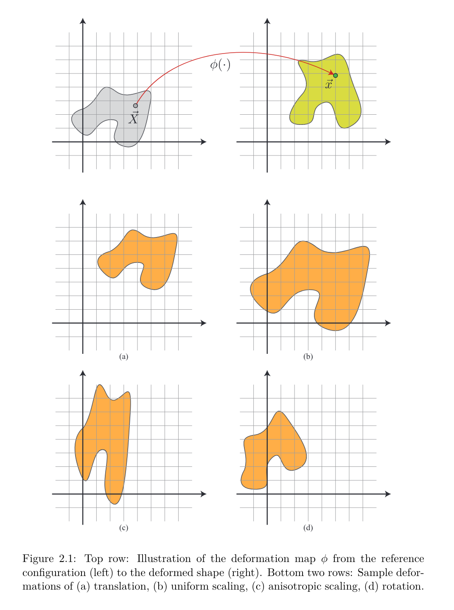
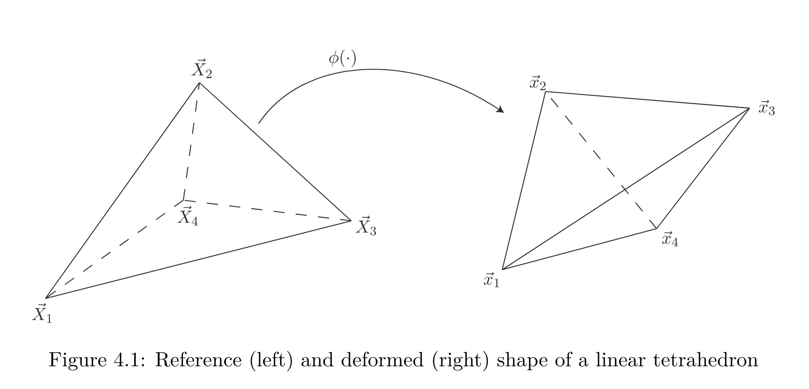

# The classical FEM method and discretization methodology

## Preface

Background Requirements:

- Familiarity with functions of several variables, partial derivaties, volume and surface integrals.

- Some exposure to numerical techniques for solving linear systems of equations, and the Newton-Raphson method for finding approximate solutions to nonlinear problems.

- A good understanding of linear algebra, including concepts such as vectors, matrices and (higher-order) tensors. Familiarity with determinants, eigenvalue problems and the Singular Value Decomposition is also assumed.

## Elasticity in three dimensions

**Key Words**: Elastic Bodies Deforming; Mass-Spring Systems; Deformable Elastic Strancs;

### Deformation map and deformation gradient

Provide a concise mathmatical description of the deformation that an elastic body has substained.

**The Reference (or undeformed) Configuration**:

- $\mathbf {\vec X} \in \Omega $: individual material points in the undeformed shape.

**Deformed Configuration:**

- $\mathbf {\vec x}$: individual material points in the deformed shape.
- $\vec \phi : \mathbf R^3 \rightarrow \mathbf R^3 $: **deformation function**, which maps every material point $\mathbf {\vec X} $ to its respective deformed location $\mathbf {\vec x} = \vec \phi(\mathbf {\vec X})$
- $\mathbf F \in \mathbf R^{3\times 3}$: **deformation gradient tensor**

If we write $\mathbf {\vec X} = (X_1, X_2, X_3)^T$ and $\vec \phi(\mathbf {\vec X}) = (\phi_1(\mathbf {\vec X}), \phi_2(\mathbf {\vec X}), \phi_3(\mathbf {\vec X}))^T$, the deformation gradient is written as:

$$
\mathbf F:= \frac{\partial(\phi_1, \phi_2, \phi_3)}{\partial(X_1, X_2, X_3)} = \begin{pmatrix}
\partial \phi_1/\partial X_1 & \partial \phi_1/\partial X_2 & \partial \phi_1/\partial X_3 \\
\partial \phi_2/\partial X_1 & \partial \phi_2/\partial X_2 & \partial \phi_2/\partial X_3 \\
\partial \phi_3/\partial X_1 & \partial \phi_3/\partial X_2 & \partial \phi_3/\partial X_3 \\
\end{pmatrix}
$$

or, in index notation $F_{ij} = \phi_{i,j}$. That is, $\mathbf F$ is the **Jacobian matrix of the deformation map**. Note that, in general, $\mathbf F$ will be spatially varying across $\Omega$; in the next sections we will use the notation $\mathbf F(\vec X)$ if such dependence needs to be made explicit.

### Strain energy and hyperelasticity

**Strain Energy**: the accumulation of potential energy in the deformed body.

- $E(\phi)$

- A significant **hypothesi**: the potential energy associated with a deformed configuration only depends on the final deformed shape, and not on the deformation path over time that brought the boyd into its current configuration.
- The independece of the strain energy on the prior deformation history is a characteristic property of so-called **hyperelastic** matetrials.
- This property of is closely related with the fact that elastic forces of hyperelastic materials are **conservative**: the total work done by the internal elastic forces in a deformation path depends solely on the initial and final configurations, not the path itself.

- Different parts of a deforming body undergo shape changes of different severity. As a consequence, the relation between deformation and strain energy is better defined on a local scale.

- Introducing an **energy density** function $\Psi[\phi; \vec X]$, which measures the strain energy per unit undeformed volume on an infinitesimal domain $dV$ around the material point $\vec X$.

- The total energy:

$$
E[\phi] = \int_\Omega\Psi[\phi; \vec X]d\vec X
$$

Let us focus on a specific material location $\vec X_*$.

Since the energy density $\Psi[\phi; \vec X]$ would only need to reflect the deformation behavior in an infinitesimal neighborhood of $\vec X_*$, we can reasonably approximate the deformation map in this tiny region using a **first-order Taylor expansion**:

$$
\phi(\vec X) \approx \phi(\vec X_*) + \frac{\partial \phi}{\partial \vec X} |_{\vec X_*} (\vec X - \vec X_*) = \vec x_* + \mathbf F(\vec X_*)(\vec X - \vec X_*) \\
 = \underbrace {\mathbf F(\vec X_*)}_{\mathbf F_*} \vec X + \underbrace {\vec x_* - \mathbf F(\vec X_*) \vec X_*}_{\vec t} = \mathbf F_*\vec X + \vec t
$$

- This equation suggests that $\Psi[\phi; \vec X]$ should be expressible as a function of $\mathbf F_*$ and $\vec t$, as these values fully parameterize the local Taylor approximation of $\phi$ near $\vec X_*$.

- Furthermore, we can expect that the value of the vector $\vec t$ would be irrelevant in this expression: different values of this parameter would indicate deformations that differ only by a constant translation, thus producing the same deformed shape and the same strain energy.

- the energy density function should be expressible as $\Psi[\phi; \vec X] = \Psi(\mathbf F (\vec X))$ , i.e. a function of the local deformation gradient alone.

### Force and traction

The elastic force incurred by a given deformation.

- $\vec f(\vec X)$: force density, or force per unit undeformed volume, in an infinitesimal region around $\vec X$.
- The aggregate force on a finite region $A ⊂ Ω$ would then be computed by integrating:

$$
\vec f_{aggregate}(A) = \int_A\vec f(\vec A) d\vec X
$$

- $\vec \tau(\vec X)$: the (surface) force density function that measures the force per unit undeformed area along an infinitesimal region of the boundary suface $\vec X$.
- The aggregate force on a finite boundary region $B ⊂ ∂Ω$ is computed by integrating:

$$
\vec f_{aggregate}(B) = \oint_B\vec \tau(\vec X) dS
$$

### The First Piola-Kirchhoff stress tensor

The **stress tensor**: 1st Piola-Kirchhoff stress tenser $\mathbf P$, a 3x3 matrix with the following properties:

- The internal traction at a boundary location $\vec X ∈ ∂Ω$ is given by

  $$
  \tau(\vec X) = -\mathbf P \cdot \vec N
  $$

  where $\vec N$ is the outward pointing unit normal to the boundary in the reference (undeformed) configuration.

  A formal definition for the stress tensor $\mathbf P$: for any interior point $\vec X ∈ Ω / ∂Ω $ we can hypothetically slice the material with a cut through $\vec X$ and perpendicular to $\vec N$ , and compute the traction along such a cut. Then, P would be the unique matrix that relates $\vec \tau$ and $\vec N$ as in equation above for all possible boundary orientations.

- The internal force density can also be computed from $\mathbf P$, as follows:
  $$
  \vec f(\vec X) = div_{\vec X} \mathbf P(\vec X), \text{ or component-wise: } f_i = \sum_{j=1}^3 P_{ij,j} = \frac{\partial P_{i1}}{\partial X_1} + \frac{\partial P_{i2}}{\partial X_2} + \frac{\partial P_{i3}}{\partial X_3}
  $$
- For hyperelastic materials, $\mathbf P$ is purely a function of the deformation gradient, and is related to the strain energy via the simple formula:
  $$
     \mathbf P(\mathbf F) = \partial \Psi(\mathbf F)/\partial \mathbf F
  $$
  As described, the **1st Piola-Kirchhoff stress tensor** can be used to yield formulas both for force and tension, and is readily computed from the strain energy density definition.

In fact, there are two equally popular (and, in fact, equivalent) ways to describe the material properties of a hyperelastic material:

- (a) an explicit formula for $Ψ$ as a function of $\mathbf F$, or
- (b) an explicit formula for $\mathbf P$ as a function of $\mathbf F$.

We will provide both types of definitions for all materials discussed in in this document.

## Constitutive models of materials

The mathematical description of the physical traits of a given material is referred to as its **constitutive model** and includes the equations that relate stimuli (e.g. deformations) to the material response (e.g. force, stress, energy) they trigger.

### Strain Measures

A **strain measure** is intended to be a quantitative descriptor for the severity of a given deformation, i.e. a way to gauge how far this configuration is from a **rest configuration**.

Consider the **Green strain tensor** $\mathbf E \in \mathbf R^{3\times3}$, defined as:

$$
\mathbf E = \frac{1}{2}(\mathbf F^T \mathbf F - \mathbf I)
$$

However, the **Green strain tensor** is a nonlinear function of deformation. To construct a linear approximation of equation above, we use a Taylor expansion around the undeformed configuration $\mathbf F = \mathbf I$:

$$
\mathbf E(\mathbf F) \approx \underbrace {\mathbf E(\mathbf I)}_{=0} + \frac{\partial \mathbf E}{\partial \mathbf F} |_{\mathbf F = \mathbf I}:(\mathbf F - \mathbf I)
$$

The derivative $∂E/∂F$ is most conveniently defined via the differential $δE$:

$$
\frac{\partial \mathbf E}{\partial \mathbf F} : \delta \mathbf F = \delta \mathbf E = \frac{1}{2}(\delta \mathbf F^T\mathbf F +\mathbf F^T\delta \mathbf F )
$$

Thus:

$$
\frac{\partial \mathbf E}{\partial \mathbf F} |_{\mathbf F = \mathbf I}:(\mathbf F - \mathbf I) = \frac{1}{2}[(\mathbf F - \mathbf I)^T\mathbf I +\mathbf I^T(\mathbf F - \mathbf I) ] = \frac{1}{2}(\mathbf F + \mathbf F^T) - \mathbf I
$$

The matrix resulting from this linear approximation of $\mathbf E(\mathbf F)$ is denoted by $\epsilon$, where:

$$
\epsilon = \frac{1}{2}(\mathbf F + \mathbf F^T) - \mathbf I
$$

and called the **small strain tensor**, or the **infinitesimal strain tensor**.

### Linear Elasticity

The simplest practical constitutive model is **linear elasticity**, defined in terms of the strain energy density as:

$$
\Psi(\mathbf F) = \mu\epsilon:\epsilon + \frac{\lambda}{2}tr^2(\epsilon)
$$

where $\epsilon$ is the small strain tensor and $μ, λ$ are the **Lamé coefficients**, which are related to the the material properties of **Young’s modulus** $k$ (a measure of **stretch resistance**) and **Poisson’s ratio** $ν$ (a measure of **incompressibility**) as:

$$
\mu = \frac{k}{2(1+ν)} \text{ } \lambda = \frac{kν}{(1+ν)(1-2ν)}
$$

The relation between the Piola stress $\mathbf P$ and $\mathbf F$ can be derived as follows:

$$
\delta \epsilon = \frac{1}{2} (\delta \mathbf F + \delta \mathbf F^T) = Sym \{ \delta \mathbf F \}\\
$$

$Sym\{\mathbf A\}$ is the symmetric component of matrix $\mathbf A$; Due to the symmetry of $\epsilon$ and $\mathbf I$

$$
\epsilon :\delta \epsilon =  \epsilon:Sym \{ \delta \mathbf F \} = \epsilon :\delta \mathbf F \\
tr(\delta \epsilon) = \mathbf I : Sym \{ \delta \mathbf F \} = \mathbf I : \delta \mathbf F \\
\delta \Psi = 2\mu\epsilon: \delta \epsilon + \lambda tr(\epsilon)tr(\delta \epsilon) = \underbrace{[2\mu\epsilon + \lambda tr(\epsilon)\mathbf I]}_{=\partial \Psi / \partial \mathbf F} : \delta \mathbf F
$$

(Since $\mathbf P = \frac{\partial \Psi}{ \partial \mathbf F}$) -> Thus $\mathbf P = 2\mu\epsilon + \lambda tr(\epsilon)\mathbf I$

or, after one final substitution for $\epsilon$ (and a few algebraic reductions):

$$
\mathbf P(\mathbf F) = \mu(\mathbf F + \mathbf F^T - 2\mathbf I) + \lambda tr(\mathbf F - \mathbf I)\mathbf I
$$

These expressions allow us to make the following observations:

- The stress $\mathbf P$ is a linear function of the deformation gradient.

- Since the small strain tensor was designed to be accurate exclusively in a small deformation scenario, it would only be advisable to use linear elasticity when the magnitude of motion is small.

### St. Venant-Kirchhoff Model

With the understanding that the small strain tensor is a mere approximation of the rotationally invariant Green strain $\mathbf E$, it makes sense to attempt an improvement of the linear elasticity model by using $\mathbf E$ in the place of $\epsilon$

$$
\Psi(\mathbf F) = \mu\mathbf E:\mathbf E + \frac{\lambda}{2}tr^2(\mathbf E)
$$

The resulting constitutive model is called a **St. Venant-Kirchhoff material**, and is the first truly nonlinear material we will examine.

The first Piola-Kirchhoff stress tensor can be computed via a process similar to the one followed for linear elasticity:

$$
\delta \mathbf E = \frac{1}{2} (\delta \mathbf F^T\mathbf F + \mathbf F^T\delta \mathbf F) = Sym \{ \mathbf F^T\delta \mathbf F \}\\
$$

Due to the symmetry of $\mathbf E$ and $\mathbf I$

$$
\mathbf E :\delta \mathbf E =  \mathbf E:Sym \{ \mathbf F^T\delta \mathbf F \} = \{ \mathbf F \mathbf E \}:\delta \mathbf F \\
tr(\delta \mathbf E) = \mathbf I : Sym \{ \mathbf F^T\delta \mathbf F \} = \mathbf F : \delta \mathbf F \\
\delta \Psi = 2\mu\mathbf E: \delta \mathbf E + \lambda tr(\mathbf E)tr(\delta \mathbf E) = \underbrace{[2\mu\mathbf E + \lambda tr(\mathbf E)\mathbf I]}_{=\partial \Psi / \partial \mathbf F} : \delta \mathbf F
$$

(Since $\mathbf P = \frac{\partial \Psi}{ \partial \mathbf F}$) -> Thus $\mathbf P = 2\mu\mathbf E + \lambda tr(\mathbf E)\mathbf I$

This is a rotationally invariant model; deformations that differ by a rigid body transformation are guaranteed to have the same strain energy.

### Corotated Linear Elasticity

**Corotated linear elasticity** is a constitutive model that attempts to combine the simplicity of the stress-deformation relationship in a linear material with just enough nonlinear characteristics to secure rotational invariance.

Using the polar decomposition $\mathbf F = \mathbf R \mathbf S$ we construct a new strain measure as $\epsilon_c = \mathbf S − \mathbf I$, which is linear on the symmetric tensor $ \mathbf S$ obtained by factoring away the rotational component of $ \mathbf F$. Replacing the small strain tensor:

$$
\Psi(\mathbf F) = \mu\epsilon_c:\epsilon_c + \frac{\lambda}{2}tr^2(\epsilon_c) = \mu||\mathbf S − \mathbf I||^2_F + (\lambda / 2)tr^2(\mathbf S − \mathbf I)
$$

### Isotropic Materials and Invariants

### Neohookean Elasticity

## Discretization

### Energy and Force Discretization

When modeling a deformable body on the computer we only store the values of the deformation map $\Phi( \vec X)$ on a finite number of points $\vec X_1, \vec X_2, . . . , \vec X_N$ , corresponding to the vertices of a discretization mesh.

The respective deformed vertex locations $\vec x_i = \phi( \vec  X_i), i = 1, 2, . . . , N$ are our discrete degrees of freedom, and we can write $\mathbf x = (\vec x_1, \vec x_2, . . . , \vec x_N )$ for the aggregate state of our model.

- As a first step, we need to specify a method for reconstructing a continuous deformation map $\hat \phi $ from the discrete samples $\vec x_i = \phi( \vec  X_i)$. In essence this is just a choice of an **interpolation** scheme. For example, if a **tetrahedral mesh** is used to describe the deforming body, **barycentric interpolation** will extend the nodal deformations to the entire interior of the mesh. **Trilinear interpolation** would be a natural choice for **lattice discretizations**. At any rate, we denote the interpolated deformation map by $\hat \phi( \vec X; \mathbf x)$ which emphasizes that this interpolated deformation is dependent on the discrete state $\mathbf x$.

For a hyperelastic material, the strain energy of any given deformation $\phi (\vec x)$ is computed by integrating the energy density $Ψ$ over the entire body $Ω$:

$$
E[\phi]:= \int_{\Omega}\Psi(\mathbf F)d\vec X
$$

We can now define a discrete energy, expressed as a function of the degrees of freedom $\mathbf x$, by simply plugging the interpolated deformation $\hat \phi $ into the definition of the strain energy:

$$
E[\mathbf x]:= E[\hat \phi(\vec X; \mathbf x)] = \int_{\Omega}\Psi(\hat {\mathbf F}(\vec X; \mathbf x))d\vec X
$$

where $\hat {\mathbf F}(\vec X; \mathbf x) := \partial \hat \phi(\vec X; \mathbf x)/\partial \vec X$ is the deformation gradient computed from the interpolated map $\hat \phi$.

Compute the elastic forces associated with individual mesh nodes, taking the negative gradient of the elastic energy with respect to the corresponding degree of freedom:

$$
\vec{f_i}(\mathbf x) = -\frac{\partial E(\mathbf x)}{\partial \vec {\mathbf x}_i}
$$

or, collectively:

$$
\mathbf f:= (\vec{f_1}, \vec{f_2}, ..., \vec{f_N}) = -\frac{\partial E(\mathbf x)}{\partial \vec {\mathbf x}}
$$

In practice, prior to computing each force, we first separate the energy integral into the contributions of individual elements $Ω_e$:

$$
E[\mathbf x] = \sum_e E^e[\mathbf x] = \sum_e\int_{\Omega_e}\Psi(\hat {\mathbf F}(\vec X; \mathbf x))d\vec X
$$

Subsequently, the force $\vec{f_i}$ on each node can be computed by adding the contributions of all elements in its immediate neighborhood $\mathcal{N}_i$:

$$
\vec{f_i}(\mathbf x) = \sum_{e\in \mathcal{N}_i} \vec{f_i^e}(\mathbf x), \text{ where } \vec{f_i^e}(\mathbf x) = - \frac{\partial E^e(\mathbf x)}{\partial \vec {\mathbf x}_i}
$$

### Linear Tetrahedral Elements

Tetrahedral meshes are among the most popular discrete volumetric geometry representations. the reconstructed deformation map $\hat \phi$ can be defined to be a piecewise linear function over each tetrahedron. Specifically, in every tetrahedron $\mathcal{T}_i$ we have:

$$
\hat\phi(\vec X) = \mathbf A_i\vec X + \vec b_i \text { for all } \vec X \in \mathcal{T}_i
$$

where the matrix $\mathbf A_i ∈ R^{3×3}$ and the vector $\vec b_i ∈ \mathbf R^3$ are specific to each tetrahedron.

The deformation gradient $\mathbf F = ∂ \hat \phi /∂ \vec X = \mathbf A_i$ is constant on each element, and as a consequence so will be any discrete strain measure and stress tensor; this justifies why linear tetrahedral elements are also referred to as constant strain tetrahedra.

For simplicity of notation we write:

$$
\hat\phi(\vec X) = \mathbf F \vec X + \vec b_i
$$

Interestingly, it is possible to determine $\mathbf F$ (and $\vec b$, if desired) directly from the locations of the tetrahedron vertices, without involving any reasoning related to barycentric interpolation.

Let us denote with $ \vec X_1, . . . , \vec X_4$ the undeformed (reference) locations of the tetrahedron vertices, and let $\vec x_1, . . . , \vec x_4$ symbolize the respective deformed vertex locations as illustrated in figure 4.1.

Each vertex must satisfy $\vec xi = \phi( \vec X_i)$, or:

$$
\begin{Bmatrix}
\vec x_1 = \mathbf F \vec X_1 + \vec b \\
\vec x_2 = \mathbf F \vec X_2 + \vec b \\
\vec x_3 = \mathbf F \vec X_3 + \vec b \\
\vec x_4 = \mathbf F \vec X_4 + \vec b \\
\end{Bmatrix} \Longrightarrow \begin{Bmatrix}
\vec x_1 - \vec x_4 = \mathbf F (\vec X_1 - \vec X_4) \\
\vec x_2 - \vec x_4 = \mathbf F (\vec X_2 - \vec X_4) \\
\vec x_3 - \vec x_4 = \mathbf F (\vec X_3 - \vec X_4) \\
\end{Bmatrix}
$$

it is possible to group the last three (vector) equations as a single matrix equation, by placing each one into the respective column of a $3 × 3$ matrix:

$$
\begin{bmatrix}
\vec x_1 - \vec x_4 & \vec x_2 - \vec x_4 & \vec x_3 - \vec x_4 \\
\end{bmatrix} = \begin{bmatrix}
\mathbf F (\vec X_1 - \vec X_4) & \mathbf F (\vec X_2 - \vec X_4) & \mathbf F (\vec X_3 - \vec X_4) \\
\end{bmatrix}
$$

$$
\begin{bmatrix}
\vec x_1 - \vec x_4 & \vec x_2 - \vec x_4 & \vec x_3 - \vec x_4 \\
\end{bmatrix} = \mathbf F \begin{bmatrix}
 (\vec X_1 - \vec X_4) & (\vec X_2 - \vec X_4) & (\vec X_3 - \vec X_4) \\
\end{bmatrix}
$$

$$
\mathbf D_s = \mathbf F \mathbf D_m
$$

where

$$
\mathbf D_s := \begin{bmatrix}
\vec x_1 - \vec x_4 & \vec x_2 - \vec x_4 & \vec x_3 - \vec x_4 \\
\vec y_1 - \vec y_4 & \vec y_2 - \vec y_4 & \vec y_3 - \vec y_4 \\
\vec z_1 - \vec z_4 & \vec z_2 - \vec z_4 & \vec z_3 - \vec z_4 \\
\end{bmatrix}
$$

is the **deformed shape matrix** and

$$
\mathbf D_m := \begin{bmatrix}
\vec X_1 - \vec X_4 & \vec X_2 - \vec X_4 & \vec X_3 - \vec X_4 \\
\vec Y_1 - \vec Y_4 & \vec Y_2 - \vec Y_4 & \vec Y_3 - \vec Y_4 \\
\vec Z_1 - \vec Z_4 & \vec Z_2 - \vec Z_4 & \vec Z_3 - \vec Z_4 \\
\end{bmatrix}
$$

is called the **reference shape matrix** (or “material-space” shape matrix).

We note that $\mathbf D_m$ is a **constant matrix**, as it only depends on the vertex coordinates in the reference (undeformed) configuration; Furthermore, the undeformed volume of the tetrahedron equals $W = \frac{1}{6}| det \mathbf D_m|$; Assuming that the reference shape of the tetrahedron is non-degenerate (i.e. nonzero volume, $W \neq 0$), the matrix $\mathbf D_m$ is nonsingular:

$$
\mathbf F = \mathbf D_s \mathbf D_m^{-1} \text { or } \mathbf F(\mathbf x) = \mathbf D_s(\mathbf x) \mathbf D_m^{-1}
$$

Since $\mathbf F$ is constant over the linear tetrahedron, the strain energy of this element reduces to:

$$
E_i = \int_{T_i}\Psi(\mathbf F)d\vec X = \Psi(\mathbf F_i)\int_{T_i}d \vec X = W \cdot \Psi(\mathbf F_i) \text{ or } E(\mathbf x) = W \cdot \Psi(\mathbf F(\mathbf x))
$$

Then derive the contribution of element $\mathcal{T}_i$ to the elastic forces on its four vertices as $ \vec f^i_k = −∂E_i(\mathbf x)/∂ \vec x_k$. In fact, the forces on all four vertices can be collectively computed via the following equations:

$$
\mathbf H = \begin{bmatrix}
\vec f_1 & \vec f_2 & \vec f_3
\end{bmatrix} = -W \mathbf P(\mathbf F)\mathbf D_m^{-T} \text { and } \vec f_4 = - \vec f_1 - \vec f_2 - \vec f_3
$$

The computation of all elastic forces in a tetrahedral mesh is summarized in pseudocode as follows:

**Algorithm 1 Batch computation of elastic forces on a tetrahedral mesh**  
1: **procedure** $Precomputation(\mathbf x, \mathbf B_m[1 . . . M ], W [1 . . . M ])$  
2: &emsp;&emsp;**for each** $\mathcal{T}_e = (i, j, k, l) \in \mathcal{M} $ **do** ($\mathcal{M}$ is the number of tetrahedra)  
3: &emsp;&emsp;&emsp;&emsp; $\mathbf D_m \leftarrow \begin{bmatrix} 
\vec X_i - \vec X_l & \vec X_j - \vec X_l & \vec X_k - \vec X_l \\
\vec Y_i - \vec Y_l & \vec Y_j - \vec Y_l & \vec Y_k - \vec Y_l \\
\vec Z_i - \vec Z_l & \vec Z_j - \vec Z_l & \vec Z_k - \vec Z_l \\
\end{bmatrix}$  
4: &emsp;&emsp;&emsp;&emsp; $\mathbf B_m[e] \leftarrow \mathbf D_m ^{-1}$  
5: &emsp;&emsp;&emsp;&emsp; $W[e] \leftarrow \frac{1}{6} det(\mathbf D_m)$ ($W$ is the undeformed volume of $\mathcal{T}_e$)  
6: &emsp;&emsp; **end for**  
7: **end procedure**  
8: **procedure** $ComputeElasticForces(\mathbf x, \mathbf f , \mathcal M, \mathbf B_m[], W [])$  
9: &emsp;&emsp; $\mathbf f \leftarrow 0$  
10: &emsp;&emsp;**for each** $\mathcal{T}_e = (i, j, k, l) \in \mathcal{M} $ **do**    
11: &emsp;&emsp;&emsp;&emsp; $\mathbf D_s \leftarrow \begin{bmatrix} 
\vec x_i - \vec x_l & \vec x_j - \vec x_l & \vec x_k - \vec x_l \\
\vec y_i - \vec y_l & \vec y_j - \vec y_l & \vec y_k - \vec y_l \\
\vec z_i - \vec z_l & \vec z_j - \vec z_l & \vec z_k - \vec z_l \\
\end{bmatrix}$  
12: &emsp;&emsp;&emsp;&emsp; $\mathbf F \leftarrow \mathbf D_s \mathbf B_m[e]$  
13: &emsp;&emsp;&emsp;&emsp; $\mathbf P \leftarrow \mathbf P(\mathbf F)$  
14: &emsp;&emsp;&emsp;&emsp; $\mathbf H \leftarrow -W[e]\mathbf P(\mathbf B_m[e])^T$  
15: &emsp;&emsp;&emsp;&emsp; $\vec f_i += \vec h_1, \vec f_j += \vec h_2, \vec f_k += \vec h_3$ ($\mathbf H = [\vec h_1, \vec h_2, \vec h_3]$)  
16: &emsp;&emsp;&emsp;&emsp; $\vec f_l += (-\vec h_1-\vec h_2-\vec h_3)$  
17: &emsp;&emsp; **end for**  
18: **end procedure**

### Force Differentials

We have seen how discrete nodal forces ($\mathbf f$ ) can be computed for an arbitrary constitutive model, given nodal positions ($\mathbf x$) as input. This is all that is necessary to implement an explicit (e.g. Forward Euler) time integration scheme; however implicit methods such as Backward Euler will also require a process for computing force differentials, i.e. linearized nodal force increments around a configuration $\mathbf x_∗$, relative to a small nodal force displacement $δ\mathbf x$. We denote this by:

$$
δ\mathbf f = δ\mathbf f(\mathbf x_∗; \delta \mathbf x) := \frac{\partial \mathbf f}{\partial \mathbf x}|_{\mathbf x = \mathbf x_∗} \cdot \delta \mathbf x
$$

Although in this expression we used the stiffness matrix $\partial \mathbf f /\partial \mathbf x$ to aid in the definition of the force differential, in practice it may be preferable to avoid constructing this matrix explicitly, as the construction cost and memory footprint associated with it may impact performance. Instead, we aim to compute the force differentials $δ\mathbf f$ directly, using only the information in the current state $\mathbf x_∗$, the displacement $δ\mathbf x$ and a small amount of additional meta-data.

As was the case with force computation, we evaluate the force differential vector $δ\mathbf f = (δ \vec f_1, δ \vec f_2, . . . , δ \vec f_N )$ on an element-by-element basis, accumulating the contribution of each element to the aggregate value of each of its nodes. Consequently, we only focus on the process for computing differentials of nodal forces for a single tetrahedron. As before, we can pack the differentials of the first three vertices $(δ \vec f_1, δ \vec f_2 \text{ and } δ \vec f_3)$ in a single matrix representation:

$$
\delta \mathbf H = [δ \vec f_1, δ \vec f_2, δ \vec f_3]
$$

$$
\delta \vec f_4 = -δ \vec f_1- δ \vec f_2- δ \vec f_3
$$

$$
\delta \mathbf H = -W \delta \mathbf P(\mathbf F; \delta \mathbf F)\mathbf D_m^{-1}
$$

Thus, the computation of nodal force differentials has been reduced to a computation of the stress differential $\delta \mathbf F$. There are two steps in completing this evaluation:

- (a) we need to construct the deformation gradient increment $\delta \mathbf F$ (the deformation gradient $\mathbf F$ itself is computed as detailed in the previous section) and
- (b) we need to provide a usable formula for $\delta \mathbf P(\mathbf F; \delta \mathbf F)$.

We start with the differential of the deformation gradient $\delta \mathbf F$:

$$
\delta \mathbf F = (\delta \mathbf D_S)\mathbf D_m^{-1}
$$

Matrix $\delta \mathbf D_S$ itself is simply computed by arranging the nodal displacements in the same fashion as nodal positions were for $\mathbf D_S$:

$$
\delta \mathbf D_s := \begin{bmatrix}
\delta x_1 - \delta x_4 & \delta x_2 - \delta x_4 & \delta x_3 - \delta x_4 \\
\delta y_1 - \delta y_4 & \delta y_2 - \delta y_4 & \delta y_3 - \delta y_4 \\
\delta z_1 - \delta z_4 & \delta z_2 - \delta z_4 & \delta z_3 - \delta z_4 \\
\end{bmatrix}
$$

The one remaining task is to provide a concise formula for $δ\mathbf P(\mathbf F; δ\mathbf F)$. By necessity, this will be a process that depends on the constitutive model itself. Here, we provide examples of this derivation for the **St. Venant-Kirchhoff**, and **Neohookean material models**:

**Stress differentials for St. Venant-Kirchhoff materials**

We start by assessing the differential of the Green strain tensor:

$$
\mathbf E = \frac{1}{2}(\mathbf F^T \mathbf F - \mathbf I) \Rightarrow \delta \mathbf E = \frac{1}{2}(\delta \mathbf F^T\mathbf F + \mathbf F^T\delta \mathbf F )
$$

We then proceed to compute the differential of the stress tensor itself:

$$
\mathbf P(\mathbf F) = \mathbf F[2\mu\mathbf E + \lambda tr(\mathbf E)\mathbf I] \Rightarrow \\
\delta P(\mathbf F; \delta \mathbf F) = \delta \mathbf F[2\mu\mathbf E + \lambda tr(\mathbf E)\mathbf I] + \mathbf F[2\mu\delta \mathbf E + \lambda tr(\delta \mathbf E)\mathbf I]
$$

**Stress differentials for Neohookean materials**

We will use without proof the following two expressions for the differential of the matrix inverse and matrix determinant:

$$
\delta[\mathbf F^{-1}] = -\mathbf F^{-1}\delta \mathbf F \mathbf F^{-1}, \text{ also } \delta[\mathbf F^{-T}] = -\mathbf F^{-T}\delta \mathbf F^T \mathbf F^{-T} \\
\delta[det \mathbf F] = det \mathbf F\cdot tr(\mathbf F^{-1} \delta \mathbf F)
$$

With these results, the differential of P is computed as

$$
\mathbf P(\mathbf F) = \mu(\mathbf F - \mathbf F^{-T}) + \lambda log(J)\mathbf F^{-T} \Rightarrow \\
\delta \mathbf P(\mathbf F; \delta \mathbf F) = \mu(\delta \mathbf F + \mathbf F^{-1}\delta \mathbf F^T \mathbf F^{-T}) + \lambda \frac{\delta [det \mathbf F]}{\mathbf J}\mathbf F^{-T} - \lambda log(J)\mathbf F^T\delta \mathbf F^T \mathbf F^{-T} \Rightarrow \\
\delta \mathbf P(\mathbf F; \delta \mathbf F) = \mu\delta\mathbf F + [\mu - \lambda log(J)]\mathbf F^{-T}\delta \mathbf F^T \mathbf F^{-T} + \lambda tr(\mathbf F ^{-1}\delta \mathbf F) \mathbf F^{-T}
$$

**Algorithm 2** Batch computation of elastic force differential on a tetrahedral mesh. Assumes that the precomputation routine from algorithm 1 is also available.  
1: **procedure** $ComputeForceDifferentials(\mathbf x, \mathbf f , \delta \mathbf x, \delta \mathbf f, \mathcal M, \mathbf B_m[], W [])$  
2: &emsp;&emsp; $\mathbf f \leftarrow 0$  
3: &emsp;&emsp;**for each** $\mathcal{T}_e = (i, j, k, l) \in \mathcal{M} $ **do**    
4: &emsp;&emsp;&emsp;&emsp; $\mathbf D_s \leftarrow \begin{bmatrix} 
x_i - x_l & x_j - x_l & x_k - x_l \\
y_i - y_l & y_j - y_l & y_k - y_l \\
z_i - z_l & z_j - z_l & z_k - z_l \\
\end{bmatrix}$  
5: &emsp;&emsp;&emsp;&emsp; $\delta \mathbf D_s \leftarrow \begin{bmatrix} 
\delta x_i - \delta x_l & \delta x_j - \delta x_l & \delta x_k - \delta x_l \\
\delta y_i - \delta y_l & \delta y_j - \delta y_l & \delta y_k - \delta y_l \\
\delta z_i - \delta z_l & \delta z_j - \delta z_l & \delta z_k - \delta z_l \\
\end{bmatrix}$  
6: &emsp;&emsp;&emsp;&emsp; $\mathbf F \leftarrow \mathbf D_s \mathbf B_m[e]$  
7: &emsp;&emsp;&emsp;&emsp; $\delta\mathbf F \leftarrow (\delta\mathbf D_s) \mathbf B_m[e]$  
8: &emsp;&emsp;&emsp;&emsp; $\delta\mathbf P \leftarrow \delta\mathbf P(\mathbf F; \delta \mathbf F)$  
9: &emsp;&emsp;&emsp;&emsp; $\delta \mathbf H \leftarrow -W[e]\mathbf (\delta P)(\mathbf B_m[e])^T$  
10: &emsp;&emsp;&emsp;&emsp; $\delta\vec f_i += \delta\vec h_1, \delta\vec f_j += \delta\vec h_2, \delta\vec f_k += \delta\vec h_3$ ($\delta\mathbf H = [\delta\vec h_1, \delta\vec h_2, \delta\vec h_3]$)  
16: &emsp;&emsp;&emsp;&emsp; $\delta\vec f_l += (-\delta\vec h_1-\delta\vec h_2-\delta\vec h_3)$  
17: &emsp;&emsp; **end for**  
18: **end procedure**

### An implicit time integration scheme

Some notations:

- $\mathbf f_e(\mathbf x_∗)$ : Elastic forces at configuration $\mathbf x_∗$, as defined in previous sections.
- $\mathbf K(\mathbf x_∗) = -\frac{\partial \mathbf f_e}{\partial \mathbf x}|_{\mathbf x_∗}$: This is the elasticity stiffness matrix evaluated around the configuration $\mathbf x_∗$. In most cases, the matrix $\mathbf K$ will never be explicitly constructed; interative solvers that involve this matrix will only require the evaluation of matrix-vector products of the form $\mathbf K\mathbf w$. These products can be computed in a matrix-free fashion by calling the force differential computation procedure detailed in Algorithm (2) with an argument $δ\mathbf x ← (−\mathbf w)$
- $\mathbf f_d(\mathbf x^∗, \mathbf v^∗) = −γ\mathbf K(\mathbf x^∗)\mathbf v^∗$ : Damping forces at position $\mathbf x^∗$ and velocity $\mathbf v^∗$ according to the Rayleigh damping model. The parameter $γ$ does not have a predetermined range (it is not confined to an interval such as [0, 1]) and can be spatially varying, or constant for simplicity.
- $\mathbf f (\mathbf x^∗, \mathbf v^∗) = \mathbf  f_e(\mathbf x^∗) + \mathbf  f_d(\mathbf x^∗, \mathbf v^∗)$ : The aggregate forces, including elastic and damping components.
- $M$ : The mass matrix. We shall assume $M$ is lumped to diagonal form.

In order to define a backward Euler integration scheme, we will need to maintain both the position ($\mathbf x^n$) and the velocity ($\mathbf  v^n$) of the deforming body at time tn. Alternatively, it would have been possible to maintain just the two previous positions $\mathbf x^n$ and $\mathbf x^{n-1}$.

The Backward Euler scheme computes the positions $\mathbf x^{n+1}$ and velocities $\mathbf v^{n+1}$ at time $t^{n+1}(:= t^n + ∆t)$ as the solution of the (nonlinear) system of equations:

$$
\mathbf x^{n+1} = \mathbf x^{n} + \Delta t \mathbf v^{n+1} \\
\mathbf v^{n+1} = \mathbf v^{n} + \Delta t \mathbf M^{-1}\mathbf f(\mathbf x^{n+1}, \mathbf v^{n+1}) = \mathbf v^{n} + \Delta t \mathbf M^{-1}(\mathbf f_e(\mathbf x^{n+1})+ \mathbf f_d(\mathbf x^{n+1}, \mathbf v^{n+1}))
$$
