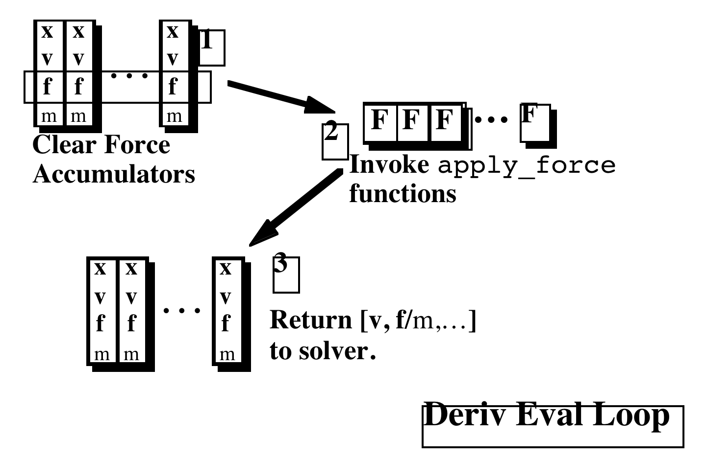

# Particle System Dynamics

Particles are objects that have mass, position, and velocity, and respond to forces, but that have no spatial extent.

## Phase Space

The Newton's $2^{nd}$ Law: $\mathbf {f} = m\mathbf a$.

$$
\ddot {\mathbf x} = \frac{\mathbf f}{m} \\
$$

$$
\dot {\mathbf v} = \frac{\mathbf f}{m} \\
\dot {\mathbf x} = \mathbf v
$$

This position/velocity product space is called phase space.

## Basic Particle Systems

Particles have mass, position, and velocity, and are subjected to forces, leading to an obvious structure definition, which in C might look like:

```c
typedef struct {
    float m;        /* mass*/
    float *x;       /* position vector */
    float *v;       /* velocity vector */
    float *f;       /* force accumulator */
} *Particle;
```


A system of particles:

```c
typedef struct {
    Particle *p;        /* array of pointers to particles */
    int n;              /* number of particles */
    float t;            /* simulation clock */
} *ParticleSystem;
```


Assume that we have a function `CalculateForces()` that, called on a particle system, adds the appropriate forces into each particle’s `f` slot. Then the operations that comprise the ODE solver interface could be written as follows:

```c
/* length of state derivative, and force vectors */
int ParticleDims(ParticleSystem p){
    return(6 * p->n);
};
/* gather state from the particles into dst */
int ParticleGetState(ParticleSystem p, float *dst){
    int i;
    for(i=0; i < p->n; i++){
        *(dst++) = p->p[i]->x[0];
        *(dst++) = p->p[i]->x[1];
        *(dst++) = p->p[i]->x[2];
        *(dst++) = p->p[i]->v[0];
        *(dst++) = p->p[i]->v[1];
        *(dst++) = p->p[i]->v[2];
    }
}
/* scatter state from src into the particles */
int ParticleSetState(ParticleSystem p, float *src){
    int i;
    for(i=0; i < p->n; i++){
        p->p[i]->x[0] = *(src++);
        p->p[i]->x[1] = *(src++);
        p->p[i]->x[2] = *(src++);
        p->p[i]->v[0] = *(src++);
        p->p[i]->v[1] = *(src++);
        p->p[i]->v[2] = *(src++);
    }
}

/* calculate derivative, place in dst */
int ParticleDerivative(ParticleSystem p, float *dst){
    int i;
    Clear_Forces(p); /* zero the force accumulators */
    Compute_Forces(p); /* magic force function */
    for(i=0; i < p->n; i++){
        *(dst++) = p->p[i]->v[0]; /* xdot=v*/
        *(dst++) = p->p[i]->v[1];
        *(dst++) = p->p[i]->v[2];
        *(dst++) = p->p[i]->f[0]/m; /* vdot = f/m */
        *(dst++) = p->p[i]->f[1]/m;
        *(dst++) = p->p[i]->f[2]/m;
    }
}
```

Having defined these operations, and assuming some utility routines and temporary vectors, an Euler solver be written as

```c
void EulerStep(ParticleSystem p, float DeltaT){
    ParticleDeriv(p,temp1); /* get deriv */
    ScaleVector(temp1,DeltaT) /* scale it */
    ParticleGetState(p,temp2); /* get state */
    AddVectors(temp1,temp2,temp2); /* add -> temp2 */
    ParticleSetState(p,temp2); /* update state */
    p->t += DeltaT; /* update time */ }
```


## Forces

Having the particle system maintain a list of force objects, each of which has access to any or all particles, and each of which “knows” how to apply its own forces.

The Calculateforces function, used above, simply traverses the list of force structures, calling each of their ApplyForce functions, with the particle system itself as sole argument.

Forces can be grouped into three broad categories:

- Unary forces, such as gravity and drag, that act independently on each particle.
- n-ary forces, such as springs, that apply forces to a fixed set of particles.
- Forces of spatial interaction, such as attraction and repulsion, that may act on any or all pairs of particles, depending on their positions.

### Unary Forces

**Gravity**: $\mathbf f = m\mathbf g$

**Viscous Drag**: $\mathbf f = -k_d \mathbf v$, where $k_d$ is called the coefficient of drag.


### n-ary forces

The spring forces between a pair of particles at positions $\mathbf a$ and $\mathbf b$ are:

$$
\begin{align}
\mathbf f_a = -[k_s(|\mathbf I| - r) + k_d\frac{\mathbf {\dot I}\cdot \mathbf I}{|\mathbf I|}]\frac{\mathbf I}{|\mathbf I|}, \mathbf f_b = -\mathbf f_a
\end{align}
$$

where $\mathbf f_a$ and $\mathbf f_b$ are the forces on $\mathbf a$ and $\mathbf b$, respectively, $\mathbf I = \mathbf a - \mathbf b$, $r$ is the rest length, $k_s$ is a spring constant, and $k_d$ is a damping constant. $\mathbf {\dot I}$, the time derivative of $\mathbf I$, is just $\mathbf v_a - \mathbf v_b$, the difference between the two particles’ velocities.


## Energy Functions

Behavior function: $\mathbf C(\mathbf x_1,...,\mathbf x_n) = 0$

Define a scalar potential energy function:

$$
E = \frac{k_s}{2}\mathbf C \cdot \mathbf C
$$

where $k_s$ is a generalized stiffness constant. Since the force due to a scalar potential is minus the energy gradient, the force on particle $x_i$ due to $\mathbf C$ is:

$$
\mathbf f_i = \frac{-\partial E}{\partial \mathbf x_i} = -ks \mathbf C \frac{\partial \mathbf C}{\partial \mathbf x_i}
$$

Add damping:

$$
\begin{align}
\mathbf f_i = (-ks \mathbf C - k_d\dot{\mathbf C}) \frac{\partial \mathbf C}{\partial \mathbf x_i}
\end{align}
$$

where $k_d$ s a generalized damping constant, and $\dot{\mathbf C}$ is the time derivative of $\mathbf C$.

Take an extremely simple example, $\mathbf C = \mathbf x_1 - \mathbf x_2$,

$$
\frac{\partial \mathbf C}{\partial \mathbf x_1} = \mathbf I , \frac{\partial \mathbf C}{\partial \mathbf x_2} = -\mathbf I
$$

where $\mathbf I$ is the identity matrix. The time derivative is:

$$
\dot{\mathbf C} = \mathbf v_1 - \mathbf v_2
$$

So, substituting into equation 2,

$$
\mathbf f_1 = -k_s(\mathbf x_1 - \mathbf x_2) - k_d(\mathbf v_1 - \mathbf v_2),
\mathbf f_2 = k_s(\mathbf x_1 - \mathbf x_2) + k_d(\mathbf v_1 - \mathbf v_2)
$$

Take another example, the behavior function $\mathbf C = |\mathbf I| - r$, where $\mathbf I = \mathbf x_1 - \mathbf x_2$.

$$
\frac{\partial \mathbf C}{\partial \mathbf I} = \frac{\mathbf I}{|\mathbf I|}
$$

$$
\frac{\partial \mathbf C}{\partial \mathbf x_1} = \frac{\partial \mathbf C}{\partial \mathbf I},
\frac{\partial \mathbf C}{\partial \mathbf x_2} = -\frac{\partial \mathbf C}{\partial \mathbf I},
$$

The time derivative of is

$$
\dot{\mathbf C} = \frac{\mathbf I \cdot \mathbf {\dot I} }{|\mathbf I|} = \frac{\mathbf I \cdot (\mathbf v_1 - \mathbf v_2) }{|\mathbf I|}
$$

## Particle/Plane Collisions and Contact

### Detection

If **P** is a point on the plane, and **N** is a normal, pointing inside. Test the sign of

$$
(\mathbf X - \mathbf P) \cdot \mathbf N
$$

to detect a collision of point **X** with the plane.
A value greater than zero means it’s inside, less than zero means it’s outside (where it isn’t allowed to be) and zero means it’s in contact.

### Response

To describe collision response, we need to partition velocity and force vectors into two orthogonal components, one normal to the collision surface, and the other parallel to it. If **N** is the normal to the collision plane, then the normal component of a vector **x** is $\mathbf x_n = (\mathbf N \cdot \mathbf x)\mathbf x$, and the tangential component is $\mathbf x_t = \mathbf x - \mathbf x_n$.

The simplest collision to consider is an elastic collision without friction. Here, the normal component of the particle’s velocity is negated, whereafter the particle goes its merry way. In an inelastic collision, the normal velocity component is instead multiplied by $r$ , where $r$ is a constant between zero and one, called the coefficient of restitution. At $r = 0$, the particle doesn’t bounce at all, and $r = .9$ is a superball.

### Contact

If a particle is on the collision surface, with zero normal velocity, then it is in contact. If a particle is pushed into the contact plane $(\mathbf N \cdot \mathbf f < 0)$ a contact force $\mathbf f_c = -(\mathbf N \cdot \mathbf f)\mathbf f$ is exerted, exactly canceling the normal component of $f$ .

In the very simplest linear friction model, the frictional force is $-k_f(-\mathbf f \cdot \mathbf N)\mathbf v_t$ , a drag force that acts in the tangential direction, with magnitude proportional to the normal force. To model a perfectly non-slippery surface, $v_t$ is simply zeroed.
