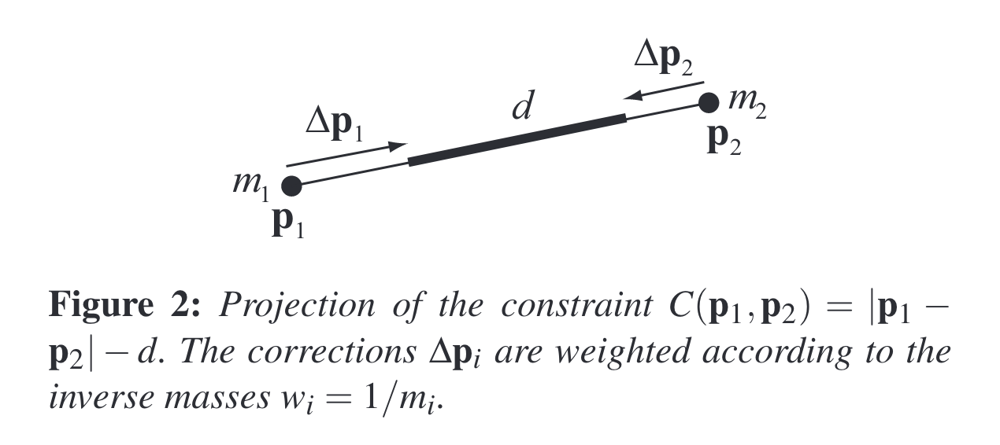
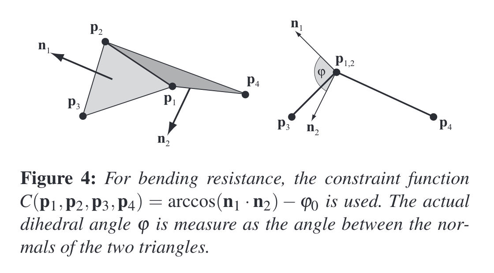
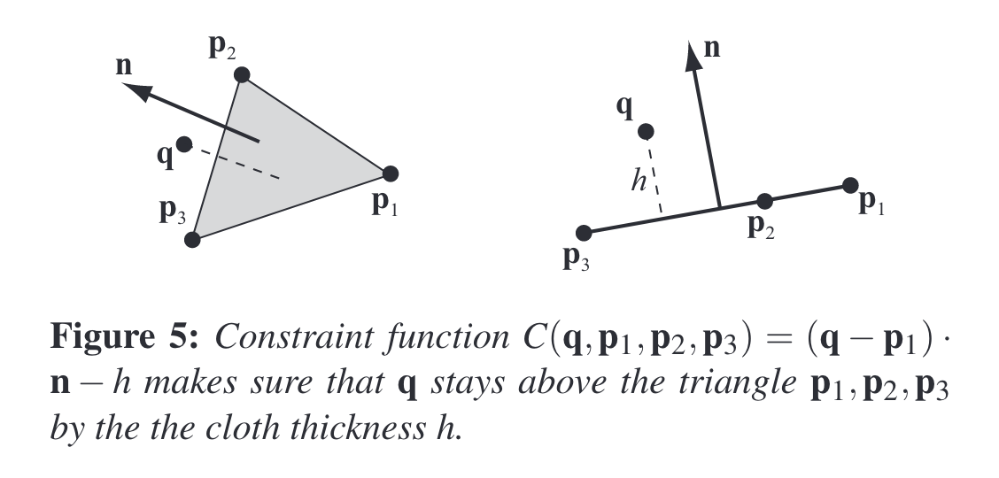

# Position Based Dynamics

## Algorithm

### Overview

We represent a dynamic object by a set of $N$ vertices and $M$ constraints. A vertex $i ∈ [1, . . . , N]$ has a mass $m_i$, a position $\mathbf x_i$ and a velocity $\mathbf v_i$.

A constraint $j ∈ [1, . . . , M]$ consists of

- a cardinality $n_j$
- a function $C_j : R^{3n_j} → R$
- a set of indices $[i_1, . . . i_{n_j}], i_k ∈ [1, . . . N]$
- a stiffness parameter $k_j ∈ [0 . . . 1]$ and
- a type of either <em>equality</em> or <em>inequality</em>.

Constraint $j$ with type equality is satisfied if $C_j(\mathbf x_{i_1} , . . . , \mathbf x_{i_{n_j}}) = 0$.

If its type is inequality then it is satisfied if $C_j(\mathbf x_{i_1} , . . . , \mathbf x_{i_{n_j}}) \geq 0$.

The stiffness parameter $k_j$ defines the strength of the constraint in a range from zero to one.

Based on this data and a time step $∆t$, the dynamic object is simulated as follows:

(1) **forall** vertices $i$

(2) &emsp;&emsp;initialize $\bold x_i = \bold x_i^0, \bold v_i = \bold v_i^0, w_i = 1 / m_i$

(3) **endfor**

(4) **loop**

(5) &emsp;&emsp;**forall** vertices $i$ **do** $\bold v_i \leftarrow \bold v_i + \Delta t w_i \bold f_{ext}(\bold x_i)$

(6) &emsp;&emsp;dampVelocities $(\bold v_1, ..., \bold v_N)$

(7) &emsp;&emsp;**forall** vertices $i$ **do** $\bold p_i \leftarrow x_i + \Delta t\bold v_i$

(8) &emsp;&emsp;**forall** vertices $i$ **do** generateCollisionConstraints $(\bold x_i \rightarrow \bold p_i)$

(9) &emsp;&emsp;**loop** solverIterations **times**

(10)&emsp;&emsp;&emsp;&emsp;projectConstraints $(C_1, ..., C_{M+M_{coll}}, \bold p_1, ..., \bold p_N)$

(11) &emsp;&emsp;**endloop**

(12)&emsp;&emsp; **forall** vertices $i$

(13)&emsp;&emsp;&emsp;&emsp; $\bold v_i \leftarrow (\bold p_i - \bold x_i) / \Delta t$

(14)&emsp;&emsp;&emsp;&emsp; $\bold x_i \leftarrow \bold p_i$

(15)&emsp;&emsp;**endfor**

(16)&emsp;&emsp;velocityUpdate $(\bold v_1,...,\bold v_N)$

(17)**endloop**

- Lines (1)-(3) just initialize the state variables.
- The **core** idea of position based dynamics is shown in lines (7), (9)(11) and (13)-(14).

  - In line (7), estimates $\bold p_i$ for new locations of the vertices are computed using an explicit **Euler integration step**.
  - The iterative solver (9)-(11) manipulates these position estimates such that they satisfy the **constraints**. It does this by repeatedly project each constraint in a **GaussSeidel** type fashion.
  - In steps (13) and (14), the positions of the vertices are moved to the optimized estimates and the velocities are updated accordingly.

- The given constraints $C_1, . . . ,C_M$ are fixed throughout the simulation.
- In addition to these constraints, line (8) generates the $M_{coll}$ collision constraints which change from time step to time step.
- The projection step in line (10) considers both, the fixed and the collision constraints.

- The scheme is **unconditionally stable**. This is because the integration steps (13) and (14) do not extrapolate blindly into the future as traditional explicit schemes do but move the vertices to a physically valid configuration pi computed by the constraint solver.
- The only possible source for instabilities is the solver itself which uses the **Newton-Raphson** method to solve for valid positions.
- However, its stability does not depend on the time step size but on **the shape of the constraint functions**.

### The Solver

### Constraint Projection

The most important issue in connection with moving points directly inside a simulation loop is **the conservation of linear and angular momentum**.

Let $∆\mathbf p_i$ be the displacement of vertex $i$ by the projection. Linear momentum is conserved if

$$
\begin{align}
\sum_i m_i \Delta \mathbf p_i = 0
\end{align}
$$

which amounts to conserving the center of mass. Angular momentum is conserved if

$$
\begin{align}
\sum_i \mathbf r_i \times m_i\Delta \mathbf p_i = 0
\end{align}
$$

where the $\mathbf r_i$ are the distances of the $\mathbf p_i$ to an arbitrary common rotation center.

Let us look at a constraint with cardinality $n$ on the points $\mathbf p_1, . . . , \mathbf p_n$ with constraint function $C$ and stiffness $k$. We let $\mathbf p$ be the concatenation $[\mathbf p_1^T , . . . , \mathbf p_n^T ]^T$ .

For internal constraints, $C$ is independent of rigid body modes, i.e. translation and rotation. This means that rotating or translating the points does not change the value of the constraint function. Therefore, the gradient $∇_pC$ is perpendicular to rigid body modes because it is the direction of maximal change.

If the correction $∆\mathbf p$ is chosen to be along $∇C_{\mathbf p}$ both momenta are automatically conserved if all masses are equal.

Given $\mathbf p$ we want to find a correction $∆\mathbf p$ such that $C(\mathbf p + ∆\mathbf p) = 0$. This equation can be approximated by

$$
\begin{align}
C(\mathbf p + \Delta \mathbf p) \approx C(\mathbf p) + \nabla{\mathbf p} C(\mathbf p) \cdot \Delta \mathbf p  = 0
\end{align}
$$

Restricting $∆\mathbf p$ to be in the direction of $∇_{\mathbf p}C$ means choosing a scalar $λ$ such that

$$
\begin{align}
\Delta \mathbf p = \lambda \nabla_{\mathbf p}C(\mathbf p)
\end{align}
$$

Substituting Eq. (4) into Eq. (3), solving for λ and substituting it back into Eq. (4) yields the final formula for $∆\mathbf p$:

$$
\begin{align}
\Delta \mathbf p = -\frac{C(\mathbf p)}{|\nabla_{\mathbf p}C(\mathbf p)|^2} \nabla_{\mathbf p}C(\mathbf p)
\end{align}
$$

which is a regular Newton-Raphson step for the iterative solution of the non-linear equation given by a single constraint.

For the correction of an individual point $\mathbf p_i$ we have

$$
\begin{align}
\Delta \mathbf p_i = -s \nabla_{\mathbf p_i}C(\mathbf p_1, ..., \mathbf p_n)
\end{align}
$$

where the scaling factor

$$
\begin{align}
s = \frac{C(\mathbf p_1, ..., \mathbf p_n)}{\sum_j|\nabla_{\mathbf p_j}C(\mathbf p_1, ..., \mathbf p_n)|^2}
\end{align}
$$

is the same for all points. If the points have individual masses, we weight the corrections $∆\mathbf p_i$ by the inverse masses $w_i = 1/m_i$. In this case a point with infinite mass, i.e. $w_i = 0$, does not move for example as expected. Now Eq. (4) is replaced by $\Delta \mathbf p_i = \lambda w_i \nabla_{\mathbf p_i}C(\mathbf p)$ yielding:

$$
\begin{align}
s = \frac{C(\mathbf p_1, ..., \mathbf p_n)}{\sum_j w_j|\nabla_{\mathbf p_j}C(\mathbf p_1, ..., \mathbf p_n)|^2}
\end{align}
$$

for the scaling factor and for the final correction

$$
\begin{align}
\Delta \mathbf p_i = -s w_i\nabla_{\mathbf p_i}C(\mathbf p_1, ..., \mathbf p_n)
\end{align}
$$

To give an example, let us consider the distance constraint function $C(\mathbf p_1, \mathbf p_2) = |\mathbf p_1 − \mathbf p_2| − d$. The derivative with respect to the points are $∇_{\mathbf p_1}C(\mathbf p_1, \mathbf p_2) = \mathbf n$ and $∇_{\mathbf p_2}C(\mathbf p_1, \mathbf p_2) = −\mathbf n$ with $\mathbf n = \frac{\mathbf p_1−\mathbf p_2}{|\mathbf p_1−\mathbf p_2| }$. The scaling factor $s$ is, thus, $s = \frac{|\mathbf p_1 −\mathbf p_2 |−d}{ \mathbf w_1+\mathbf w_2}$ and the final corrections:

$$
\begin{align}
\Delta \mathbf p_1 = -\frac{w_1}{ w_1 + w_2}(|\mathbf p_1 −\mathbf p_2 |−d)\frac{\mathbf p_1−\mathbf p_2}{|\mathbf p_1−\mathbf p_2| }
\end{align}
$$

$$
\begin{align}
\Delta \mathbf p_2 = +\frac{w_2}{ w_1 + w_2}(|\mathbf p_1 −\mathbf p_2 |−d)\frac{\mathbf p_1−\mathbf p_2}{|\mathbf p_1−\mathbf p_2| }
\end{align}
$$

- If the type is equality we always perform a projection. If the type is inequality, the projection is only performed if $C(\mathbf p_1, . . . , \mathbf p_n) < 0$.
- The simplest variant is to multiply the corrections $∆\mathbf p$ by $k ∈ [0 . . . 1]$.
- However, for multiple iteration loops of the solver, the effect of $k$ is non-linear. The remaining error for a single distance constraint after ns solver iterations is $∆\mathbf p(1 − k)^{n_s}$ .
- To get a linear relationship we multiply the corrections not by $k$ directly but by $k^{\prime} = 1 − (1 − k)^{1/n_s}$ .
- With this transformation the error becomes $∆\mathbf p(1 − k^′)^{n_s} = ∆\mathbf p(1 − k)$ and, thus, becomes linearly dependent on k and independent of ns as desired.

### Collision Detecton and Response

In line (8) of the simulation algorithm the $M_{coll}$ collision constraints are generated. While the first $M$ constraints given by the object representation are fixed throughout the simulation, the additional $M_{coll}$ constraints are generated from scratch at each time step.

For continuous collision handling, we test for each vertex $i$ the ray $\mathbf x_i → \mathbf p_i$.

If this ray enters an object, we compute the entry point $\mathbf q_c$ and the surface normal $\mathbf n_c$ at this position.

An inequality constraint with constraint function $C(\mathbf p) = (\mathbf p − \mathbf q_c) · \mathbf n_c$ and stiffness $k = 1$ is added to the list of constraints.

If the ray $\mathbf x_i → \mathbf p_i$ lies completely inside an object, continuous collision detection has failed at some point.

In this case we fall back to static collision handling. We compute the surface point $\mathbf q_s$ which is closest to $ \mathbf p_i$ and the surface normal $\mathbf n_s$ at this position.

An inequality constraint with constraint function $C(\mathbf p) = (\mathbf p − \mathbf q_s) · \mathbf n_s$ and stiffness $k = 1$ is added to the list of constraints.

Collision constraint generation is done outside of the solver loop. This makes the simulation much faster.

Friction and restitution can be handled by manipulating the velocities of colliding vertices in step (16) of the algorithm. The velocity of each vertex for which a collision constraint has been generated is dampened perpendicular to the collision normal and reflected in the direction of the collision normal.

he collision handling discussed above is only correct for collisions with static objects because no impulse is transferred to the collision partners. Correct response for two dynamic colliding objects can be achieved by simulating both objects with our simulator, i.e. the $N4 vertices and $M$ constraints which are the input to our algorithm simply represent two or more independent objects.

Then, if a point q of one objects moves through a triangle $\mathbf p_1, \mathbf p_2, \mathbf p_3$ of another object, we insert an inequality constraint with constraint function $C(\mathbf q, \mathbf p_1, \mathbf p_2, \mathbf p_3) = ±(\mathbf q − \mathbf p_1) · [(\mathbf p_2 − \mathbf p_1) × (\mathbf p_3 − \mathbf p_1)]$ which keeps the point $ \mathbf q$ on the correct side of the triangle.

Since this constraint function is independent of rigid body modes, it will correctly conserve linear and angular momentum. Collision detection gets slightly more involved because the four vertices are represented by rays $\mathbf x_i → \mathbf p_i$. Therefore the collision of a moving point against a moving triangle needs to be detected

### Damping

In line (6) of the simulation algorithm the velocities are dampened before they are used for the prediction of the new positions.

### Attachments

With the position based approach, attaching vertices to static or kinematic objects is quite simple. The position of the vertex is simply set to the static target position or updated at every time step to coincide with the position of the kinematic object. To make sure other constraints containing this vertex do not move it, its inverse mass $w_i$ is set to zero.

## Cloth Simulation

### Representation of Cloth

Our cloth simulator accepts as input arbitrary triangle meshes. The only restriction we impose on the input mesh is that it represents a manifold, i.e. each edge is shared by at most two triangles. Each node of the mesh becomes a simulated vertex.

The user provides a density $ρ$ given in mass per area $[kg/m^2]$. The mass of a vertex is set to the sum of one third of the mass of each adjacent triangle.

For each edge, we generate a stretching constraint with constraint function

$$
C_{stretch}(\mathbf p_1, \mathbf p_2) = |\mathbf p_1 − \mathbf p_2| − l0,
$$

stiffness $k_{stretch}$ and type $equality$. The scalar $\varphi_0$ is the initial length of the edge and kstretch is a global parameter provided by the user. It defines the stretching stiffness of the cloth. For each pair of adjacent triangles $(\mathbf p_1, \mathbf p_3, \mathbf p_2)$ and $(\mathbf p_1, \mathbf p_2, \mathbf p_4)$ we generate a bending constraint with constraint function

$$
C_{bend}(\mathbf p_1, \mathbf p_2, \mathbf p_3, \mathbf p_4) = acos(\frac{(\mathbf p_2 − \mathbf p_1) × (\mathbf p_3 − \mathbf p_1)}{|(\mathbf p_2 − \mathbf p_1) × (\mathbf p_3 − \mathbf p_1)|} \cdot \frac{(\mathbf p_2 − \mathbf p_1) × (\mathbf p_4 − \mathbf p_1)}{|(\mathbf p_2 − \mathbf p_1) × (\mathbf p_4 − \mathbf p_1)|}) - \varphi_0,
$$

stiffness $k_{bend}$ and type $equality$. The scalar $φ_0$ is the initial dihedral angle between the two triangles and $k_{bend}$ is a global user parameter defining the bending stiffness of the cloth (see Figure 4).

### Collision with Rigid Bodies

To get two-way interactions, we apply an impulse $m_i∆\mathbf p_i/∆t$ to the rigid body at the contact point, each time vertex $i$ is projected due to collision with that body. Testing only cloth vertices for collisions is not enough because small rigid bodies can fall through large cloth triangles. Therefore, collisions of the convex corners of rigid bodies against the cloth triangles are also tested.

### Self Collision

Assuming that the triangles all have about the same size, we use **spatial hashing** to find vertex triangle collisions. If a vertex $\mathbf q$ moves through a triangle $\mathbf p_1, \mathbf p_2, \mathbf p_3$, we use the constraint function:

$$
\begin{align}
C(\mathbf q, \mathbf p_1, \mathbf p_2, \mathbf p_3) = (\mathbf q − \mathbf p_1) · \frac{(\mathbf p_2 − \mathbf p_1) × (\mathbf p_3 − \mathbf p_1)}{|(\mathbf p_2 − \mathbf p_1) × (\mathbf p_3 − \mathbf p_1)|} - h
\end{align}
$$

where $h$ is the cloth thickness (see Figure 5).

If the vertex enters from below with respect to the triangle normal, the constraint function has to be

$$
\begin{align}
C(\mathbf q, \mathbf p_1, \mathbf p_2, \mathbf p_3) = (\mathbf q − \mathbf p_1) · \frac{(\mathbf p_3 − \mathbf p_1) × (\mathbf p_2 − \mathbf p_1)}{|(\mathbf p_3 − \mathbf p_1) × (\mathbf p_2 − \mathbf p_1)|} - h
\end{align}
$$

to keep the vertex on the original side. Projecting these constraints conserves linear and angular momentum which is essential for cloth self collision since it is an internal process.

