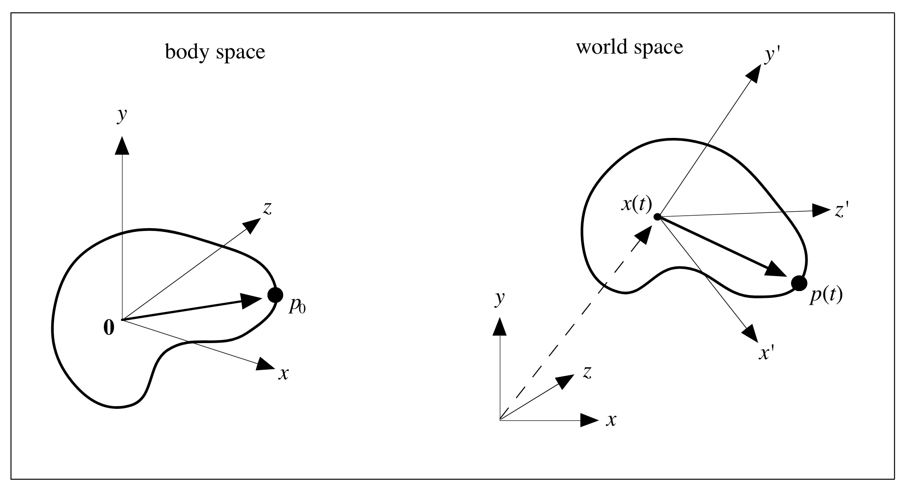
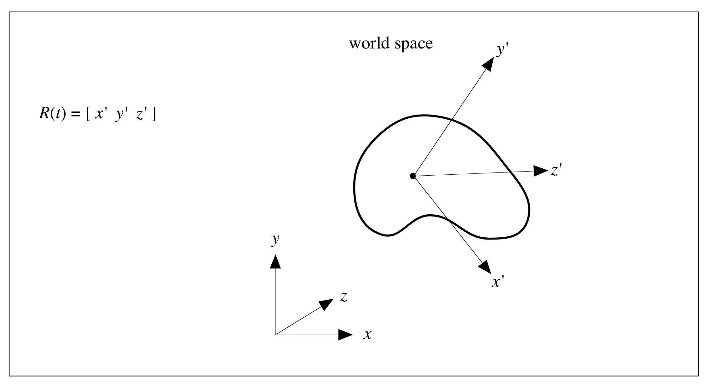
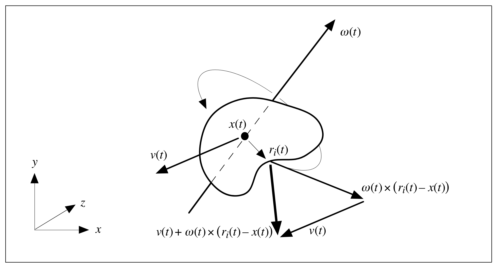

# Rigid Body Simulation

# Part I. Unconstrained Rigid Body Dynamics

## Simulation Basics

- $x(t)$ the particle’s location in world space at time $t$.

- $v(t) = \dot x(t) = \frac{d}{dt}x(t)$ the velocity of the particle at time $t$.

Defining a state vector $\bold Y(t)$ for a system: for a single particle,

$$
\begin{align}
\bold Y(t) = \dbinom{x(t)}{v(t)}
\end{align}
$$

For a system with n particles, we enlarge $\bold Y(t)$ to be

$$
\begin{align}
\bold Y(t) = \begin{pmatrix}
x_1(t)  \\
v_1(t) \\
\vdots \\
x_n(t) \\
v_n(t)
\end{pmatrix}
\end{align}
$$

- $F(t)$ the force acting on our particle at time $t$.

If the particle has mass m, then the change of $\bold Y$ over time is given by

$$
\begin{align}
\frac{d}{dt}\bold Y(t) = \frac{d}{dt}\dbinom{x(t)}{v(t)} = \dbinom{v(t)}{F(t)/m}
\end{align}
$$

Assume we have access to a numerical solver, which we’ll generically write as a function named $ode$. Typically, $ode$ has the following specification:

```c
typedef void (*dydt_func)(double t, double y[], double ydot[]);

void ode(double y0[], double yend[], int len, double t0, double t1, dydt_func dydt);
```

## Rigid Body Concepts

### Position and Orientation

$$
\begin{align}
p(t) = R(t)p_0 + x(t)
\end{align}
$$

$$
\begin{align}
R(t) = \begin{pmatrix}
r_{xx} & r_{yx} & r_{zx} \\
r_{xy} & r_{yy} & r_{zy} \\
r_{xz} & r_{yz} & r_{zz} \\
\end{pmatrix}
\end{align}
$$



$x^\prime = R(t)x$, $y^\prime = R(t)y$, $z^\prime = R(t)z $

$$
\begin{align}
R(t)\begin{pmatrix}
1 \\
0 \\
0 \\
\end{pmatrix} = \begin{pmatrix}
r_{xx} \\
r_{xy} \\
r_{xz} \\
\end{pmatrix}
\end{align}
$$



### Linear Velocity

$$
\begin{align}
v(t) = \dot x(t)
\end{align}
$$


### Angular Velocity

$$
\begin{align}
|\omega(t) \times b| = |\omega(t)||b|
\end{align}
$$

$$
\begin{align}
\dot r(t) = \omega(t) \times b = \omega(t) \times b + \omega(t) \times a = \omega(t) \times (b + a)
\end{align}
$$

$$
\begin{align}
\dot r(t) = \omega(t) \times r(t)
\end{align}
$$


$$
\begin{align}
\dot R(t) = \begin{pmatrix}
\omega(t) \times \begin{pmatrix} r_{xx} \\ r_{xy} \\ r_{xz} \end{pmatrix} &
\omega(t) \times \begin{pmatrix} r_{yx} \\ r_{yy} \\ r_{yz} \end{pmatrix} &
\omega(t) \times \begin{pmatrix} r_{zx} \\ r_{zy} \\ r_{zz} \end{pmatrix}
\end{pmatrix}
\end{align}
$$

If $a$ and $b$ are 3-vectors, then $a \times b$ is the vector:

$$
\begin{pmatrix}
a_yb_z - b_ya_z \\
-a_xb_z + b_xa_z \\
a_xb_y - b_xa_y
\end{pmatrix}
$$

define $a^*$ to be the matrix:

$$
\begin{pmatrix}
0 & -a_z & a_y \\
a_z & 0 & -a_x \\
-a_y & a_x & 0 \\
\end{pmatrix}
$$

Then:

$$
\begin{align}
a^*b = \begin{pmatrix}
0 & -a_z & a_y \\
a_z & 0 & -a_x \\
-a_y & a_x & 0 \\
\end{pmatrix} \begin{pmatrix}
b_x \\
b_y \\
b_z \\
\end{pmatrix} = \begin{pmatrix}
a_yb_z - b_ya_z \\
-a_xb_z + b_xa_z \\
a_xb_y - b_xa_y
\end{pmatrix} = a \times b
\end{align}
$$

Rewrite $\dot R(t)$ :

$$
\begin{align}
\dot R(t) = \begin{pmatrix}
\omega(t)^* \begin{pmatrix} r_{xx} \\ r_{xy} \\ r_{xz} \end{pmatrix} &
\omega(t)^* \begin{pmatrix} r_{yx} \\ r_{yy} \\ r_{yz} \end{pmatrix} &
\omega(t)^* \begin{pmatrix} r_{zx} \\ r_{zy} \\ r_{zz} \end{pmatrix}
\end{pmatrix}
\end{align}
$$

$$
\begin{align}
\dot R(t) = \omega(t)^*\begin{pmatrix}
 \begin{pmatrix} r_{xx} \\ r_{xy} \\ r_{xz} \end{pmatrix} &
 \begin{pmatrix} r_{yx} \\ r_{yy} \\ r_{yz} \end{pmatrix} &
 \begin{pmatrix} r_{zx} \\ r_{zy} \\ r_{zz} \end{pmatrix}
\end{pmatrix}
\end{align}
$$

$$
\begin{align}
\dot R(t) = \omega(t)^*R(t)
\end{align}
$$

### Mass of Body

$$
\begin{align}
r_i(t) = R(t)r_{0i} + x(t)
\end{align}
$$

$$
\begin{align}
M = \sum_{i=1}^N m_i
\end{align}
$$

### Velocity of a Particle

$$
\begin{align}
\dot r_i(t) = \omega^*R(t)r_{0i} + v(t)
\end{align}
$$

Rewrite this as:

$$
\begin{align}
\dot r_i(t) = \omega(t)^*R(t)r_{0i} + v(t) = \omega(t)^*(R(t)r_{0i} + x(t) - x(t)) + v(t) = \omega(t)^*(r_i(t) - x(t)) + v(t)
\end{align}
$$



$$
\begin{align}
\dot r_i(t) = \omega(t) \times (r_i(t) - x(t)) + v(t)
\end{align}
$$

Separate the velocity of a point on a rigid body into two components: a linear component $v(t)$, and an angular component $\omega \times (r_i(t) - x(t))$.

### Center of Mass

$$
\begin{align}
\frac{\sum m_i r_i(t)}{M}
\end{align}
$$

In body space:

$$
\begin{align}
\frac{\sum m_i r_{0i}(t)}{M} = \bold 0 = \begin{pmatrix} 0 \\ 0 \\ 0 \end{pmatrix}
\end{align}
$$

In world space:

$$
\frac{\sum m_i r_{i}(t)}{M} =\frac{\sum m_i(R(t)r_{0i} + x(t))}{M}  = \frac{R(t)\sum m_ir_{0i} + \sum m_i x(t)}{M} = x(t)\frac{\sum m_i}{M} = x(t)
$$

$$
\begin{align}
\sum m_i(r_i(t) - x(t)) = \sum m_i(R(t)r_{0i} + x(t) - x(t)) = R(t)\sum m_i r_{0i} = 0
\end{align}
$$

### Force and Torque


$$
\begin{align}
\tau_i(t) = (r_i(t) - x(t)) \times F_i(t)
\end{align}
$$

$$
\begin{align}
F(t) = \sum F_i(t)
\end{align}
$$

$$
\begin{align}
\tau(t) = \sum \tau_i(t) = \sum (r_i(t) - x(t)) \times F_i(t)
\end{align}
$$

### Linear Momentum

$$
\begin{align}
p = mv
\end{align}
$$

$$
\begin{align}
P(t) = \sum m_i \dot r_i(t)
\end{align}
$$

$$
\dot r_i(t) = v(t) + \omega^ \times (r_i(t) - x(t))
$$

$$
\begin{align}
P(t) = \sum m_i \dot r_i(t) = \sum(m_iv(t) + m_i\omega(t)\times (r_i(t) - x(t))) = \sum m_iv(t) + \omega(t) \times \sum m_i (r_i(t) - x(t))
\end{align}
$$

$$
\begin{align}
P(t) = \sum m_i v(t) = Mv(t)
\end{align}
$$

$$
\begin{align}
\dot v(t) = \frac{\dot P(t)}{M}
\end{align}
$$

$$
\begin{align}
\dot P(t) = F(t)
\end{align}
$$

$$
\begin{align}
\dot v(t) = \frac{F(t)}{M}
\end{align}
$$

### Angular Momentum

$$
L(t) = I(t)\omega(t)
$$

$I(t)$ is a 3 x 3 matrix (technically a rank-two tensor) called the inertia tensor.

$$
\begin{align}
\dot L(t) = \tau(t)
\end{align}
$$

### The Inertia Tensor

$$
\begin{align}
I_{body} = \sum m_i((r_{0i}^Tr_{0i})\bold I - r_{0i}r_{0i}^T)
\end{align}
$$

$$
\begin{align}
I(t) = R(t)I_{body}R(t)^T
\end{align}
$$

$$
\begin{align}
I(t)^{-1} = R(t)I_{body}^{-1}R(t)^T
\end{align}
$$

### Rigid Body Equations of Motion

$$
\begin{align}
\bold Y(t) = \begin{pmatrix} x(t) \\ R(t) \\ P(t)  \\ L(t) \end{pmatrix}
\end{align}
$$

$$
\begin{align}
v(t) = \frac{P(t)}{M}, I(t) = R(t)I_{body}R(t)^T, \omega(t) = I(t)^{-1}L(t)
\end{align}
$$

$$
\begin{align}
\frac{d}{dt} \bold Y(t) = \frac{d}{dt} \begin{pmatrix} x(t) \\ R(t) \\ P(t)  \\ L(t) \end{pmatrix} = \begin{pmatrix} v(t) \\ \omega(t)^*R(t) \\ F(t)  \\ \tau(t) \end{pmatrix}
\end{align}
$$

## Computing $\frac{d}{dt}\bold Y(t)$

```cpp
struct RigidBody {
    /* Constant quantities */
    double mass;        /* mass M */
    matrix Ibody,       /* I_body */
           Ibodyinv;    /* I_body^-1 (inverse of Ibody)*/
    /* State variables */
    triple x;   /* x(t) */
    matrix R;   /* R(t) */
    triple P,   /* P(t) */
    L;          /* L(t) */

    /* Derived quantities (auxiliary variables) */
    matrix Iinv;    /* I−1(t) */
    triple v,       /* v(t) */
           omega;   /* w(t) */

    /* Computed quantities */
    triple force,   /* F(t) */
           torque;  /* \tau(t) */
}
```

assume a global array of bodies:

```cpp
    RigidBody Bodies[NBODIES];
```

```cpp
/* Copy the state information into an array */
void State_to_Array(RigidBody *rb, double *y) {
    *y++ = rb->x[0]; /* x component of position */
    *y++ = rb->x[1]; /* etc. */
    *y++ = rb->x[2];
    for(int i = 0; i < 3; i++) /* copy rotation matrix */
        for(int j = 0; j<3; j++)
            *y++ = rb->R[i,j];
    *y++ = rb->P[0];
    *y++ = rb->P[1];
    *y++ = rb->P[2];
    *y++ = rb->L[0];
    *y++ = rb->L[1];
    *y++ = rb->L[2];
}
/* Copy information from an array into the state variables */
void Array_to_State(RigidBody *rb, double *y) {
    rb->x[0] = *y++;
    rb->x[1] = *y++;
    rb->x[2] = *y++;
    for(int i = 0; i < 3; i++)
        for(int j = 0;j<3;j++)
            rb->R[i,j] = *y++;
    rb->P[0] = *y++;
    rb->P[1] = *y++;
    rb->P[2] = *y++;
    rb->L[0] = *y++;
    rb->L[1] = *y++;
    rb->L[2] = *y++;

    /* Compute auxiliary variables... */
    /* v(t) = P(t) / M */
    rb->v = rb->P / mass;

    /* I−1(t) / R(t)I_body^-1 R(t)^T*/
    rb->Iinv = R * Ibodyinv * Transpose(R);

    /* !(t) / I−1(t)L(t) */
    rb->omega = rb->Iinv * rb->L; }
```

Transfers between all the members of Bodies andanarrayy of size $18 \cdot NBODIES$ are implemented as

```cpp
#define STATE_SIZE 18

void Array_to_Bodies(double y[]) {
    for(int i = 0; i < NBODIES; i++)
        Array_to_State(&Bodies[i], &y[i * STATE_SIZE]);
}

void Bodies_to_Array(double y[]) {
    for(int i = 0; i < NBODIES; i++)
        State_to_Array(&Bodies[i], &y[i * STATE_SIZE]);
}
```

```cpp
void Compute_Force_and_Torque(double t, RigidBody *rb);
```

```cpp
void dydt(double t, double y[], double ydot[]) {
    /* put data in y[] into Bodies[] */
    Array_to_Bodies(y);

    for(int i = 0; i < NBODIES; i++) {
        Compute_Force_and_Torque(t, &Bodies[i]);
        ddt_State_to_Array(&Bodies[i], &ydot[i * STATE_SIZE]);
    }
}
```

```cpp
void ddt_State_to_Array(RigidBody *rb, double *ydot) {
    /* copy d/dt x(t) = v(t) into ydot */
    *ydot++ = rb->v[0];
    *ydot++ = rb->v[1];
    *ydot++ = rb->v[2];

    /* Compute \dot R(t) = w(t)* R(t) */
    matrix Rdot = Star(rb->omega) * rb->R;

    /* copy \dot R(t) into array */
    for(int i = 0; i < 3; i++)
        for(int j = 0;j<3;j++)
            *ydot++ = Rdot[i,j];

    *ydot++ = rb->force[0]; /* d/dt P(t) = F(t) */
    *ydot++ = rb->force[1];
    *ydot++ = rb->force[2];

    *ydot++ = rb->torque[0]; /* d/dt L(t) = \tau(t)/ */
    *ydot++ = rb->torque[1];
    *ydot++ = rb->torque[2];
}
```

```cpp
matrix Star(triple a);
```

$$
\begin{pmatrix}
0 & -a[2] & a[1] \\
a[2] & 0 & -a[0] \\
-a[1] & a[0] & 0 \\
\end{pmatrix}
$$

```cpp
void RunSimulation() {
    double y0[STATE_SIZE * NBODIES],
           yfinal[STATE_SIZE * NBODIES];

    InitStates();
    Bodies_to_Array(yfinal);
    for(double t = 0; t < 10.0; t += 1./30.) {
        /* copy yfinal back to y0 */
        for(int i = 0; i < STATE_SIZE * NBODIES; i++)
            y0[i] = yfinal[i];

        ode(y0, yfinal, STATE_SIZE * NBODIES, t, t+1./30., dydt);

        /* copy d dtY.t C 1 30 / into state variables */

        Array_to_Bodies(yfinal);
        DisplayBodies();
    }
}
```

## Quaternions vs. Rotation Matrices

Write a quaternion $s + v_x\bold i + v_y\bold j + v_z\bold k$ as the pair:

$$
[s, v]
$$

Using this notation, quaternion multiplication is

$$
\begin{align}
[s_1, v_1][s_2, v_2] = [s_1s_2 - v_1 \cdot v_2, s_1v_2 + s_2v_1 + v_1 \times v_2]
\end{align}
$$

A rotation of $\theta$ radians about a unit axis $u$ is represented by the unit quaternion

$$
[cos(\theta/2), sin(\theta/2)u]
$$

In using quaternions to represent rotations, if $q_1$ and $q_2$ indicate rotations, then $q_2q_1$ represents the composite rotation of $q_1$ followed by $q_2$.

$$
\dot q = \frac{1}{2}\omega(t)q(t)
$$

where the multiplication $\omega(t)q(t)$ is a shorthand for multiplication between the quaternions $[0,\omega(t)]$ and $q(t)$.

Redefine the type `RigidBody`:

```cpp
struct RigidBody {
    /* Constant quantities */
    double mass;        /* mass M */
    matrix Ibody,       /* Ibody */
           Ibodyinv;    /* I−1 body (inverse of Ibody)*/

    /* State variables */
    triple x;       /* x(t) */
    quaternion q;   /* q(t) */
    triple P,       /* P(t) */
           L;       /* L(t) */

    /* Derived quantities (auxiliary variables) */
    matrix Iinv,    /* I−1(t) */
           R;       /* R(t) */

    triple v,       /* v(t) */
           omega;   /* w(t) */

    /* Computed quantities */
    triple force,   /* F(t) */
            torque; /* \tau(t) */ };
```

Next, in the routine `State_to_Array`, we’ll replace the double loop

```cpp
for(int i = 0; i < 3; i++) /* copy rotation matrix */
    for(int j = 0; j<3; j++)
        *y++ = rb->R[i,j];
```

with

```cpp
/*
 * Assume that a quaternion is represented in
 * terms of elements ‘r’ for the real part,
 * and ‘i’, ‘j’, and ‘k’ for the vector part.
 */
 *y++ = rb->q.r;
 *y++ = rb->q.i;
 *y++ = rb->q.j;
 *y++ = rb->q.k;
```

A similar change is made in `Array_to_State`.

```cpp
rb->R = quaternion_to_matrix(normalize(rb->q));
```

Given a quaternion $q = [s,v]$, quaternion_to_matrix returns the matrix

$$
\begin{pmatrix}
1 -2v_y^2 - 2v_z^2 & 2v_xv_y - 2sv_z & 2v_xv_z + 2sv_y  \\
2v_xv_y + 2sv_z  & 1 -2v_x^2 - 2v_z^2 & 2v_yv_z - 2sv_x  \\
2v_xv_z - 2sv_y  & 2v_yv_z + 2sv_x  & 1 -2v_x^2 - 2v_y^2 \\
\end{pmatrix}
$$

```cpp
quaternion matrix_to_quaternion(const matrix &m) {
    quaternion q;
    double tr, s;

    tr = m[0,0] + m[1,1] + m[2,2];

    if(tr >= 0) {
        s = sqrt(tr + 1);
        q.r = 0.5 * s;
        s = 0.5/s;
        q.i = (m[2,1] - m[1,2]) * s;
        q.j = (m[0,2] - m[2,0]) * s;
        q.k = (m[1,0] - m[0,1]) * s;
    } else {
        int i = 0;

        if(m[1,1] > m[0,0])
            i=1;
        if(m[2,2] > m[i,i))
            i=2;

        switch (i) {
            case 0:
                s = sqrt((m[0,0] - (m[1,1] + m[2,2])) + 1);
                q.i = 0.5 * s;
                s=0.5/s;
                q.j = (m[0,1] + m[1,0]) * s;
                q.k = (m[2,0] + m[0,2]) * s;
                q.r = (m[2,1] - m[1,2]) * s;
                break;
            case 1:
                s = sqrt((m[1,1] - (m[2,2] + m[0,0])) + 1);
                q.j = 0.5 * s; s=0.5/s;
                q.k = (m[1,2] + m[2,1]) * s;
                q.i = (m[0,1] + m[1,0]) * s;
                q.r = (m[0,2] - m[2,0]) * s;
                break;
            case 2:
                s = sqrt((m[2,2] - (m[0,0] + m[1,1])) + 1);
                q.k = 0.5 * s;
                s=0.5/s;
                q.i = (m[2,0] + m[0,2]) * s;
                q.j = (m[1,2] + m[2,1]) * s;
                q.r = (m[1,0] - m[0,1]) * s;
        }
    }
    return q;
}
```

The only other change we need is in `ddt_State_to_Array`:

```cpp
quaternion qdot = .5 * (rb->omega * rb->q);
*ydot++ = qdot.r;
*ydot++ = qdot.i;
*ydot++ = qdot.j;
*ydot++ = qdot.k;
```

## Examples

todo
