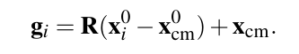

# Shape Matching

A creative approach for simulating **deformable objects**.

**Main idea:**

- Replace energies with **geometric constraints.**
- Replace **forces** by distances of current positions to goal positions.

### Meshless Animation

- Illustrate instability aspects of explicit integration schemes.
- how to obtain unconditional stability using a purely geometric scheme

**Explicit Numerical Integration**

a linear undamped mass-spring system

resting length: $l_0$

Spring constant: $k$

T**he modified Euler integration scheme:**

- only conditionally stable
- overshooting / blew up

**The Algorithm**

- First, the original shape $\bold x_i^0$ is matched to the deformed shape $\bold x_i$
- Then, the deformed points $\bold x_i$ are pulled towards the matched shape $\bold g_i$

## Shape Matching

- Given two sets of points $\bold x_i^0$ and $\bold x_i$ . Find the rotation matrix $\bold R$ and the translation vectors $\bold t$ and $\bold t_0$ which minimize
  
  
- Integration
  

$$
\bold R = \bold A_{pq}\bold S^{-1} \\ A = \sqrt{\bold A_{pq} ^ T \bold A_{pq}} \\ \bold A_{pq} = \sum_i{m_i\bold p_i\bold q_i^T} \\\bold p_i = \bold x_i - \bold x_{cm} \\ \bold q_i = \bold x_i^0 - \bold x_{cm}^0
$$

## References:

[1] Meshless Deformations Based on Shape Matching [https://doi.org/10.1145/1073204.1073216](https://doi.org/10.1145/1073204.1073216)

[2] PBA 2014: Shape Matching [[youtube](https://www.youtube.com/watch?v=6Zsv2PyeQ5c&list=PL_a9tY9IhJuM2dIVCH_ZC0Pn5871eDY7_&index=3&ab_channel=LadislavKavan)]

[3] GAMES 103: Shape Matching [[bilibili](https://www.bilibili.com/video/BV12Q4y1S73g?p=4&vd_source=090c8b9d2b6f5026cf63d68df4e4f527)]

[4] code [[github](https://github.com/zhiyuXiao1221/Meshless-Deformations-Based-on-Shape-Matching)]
